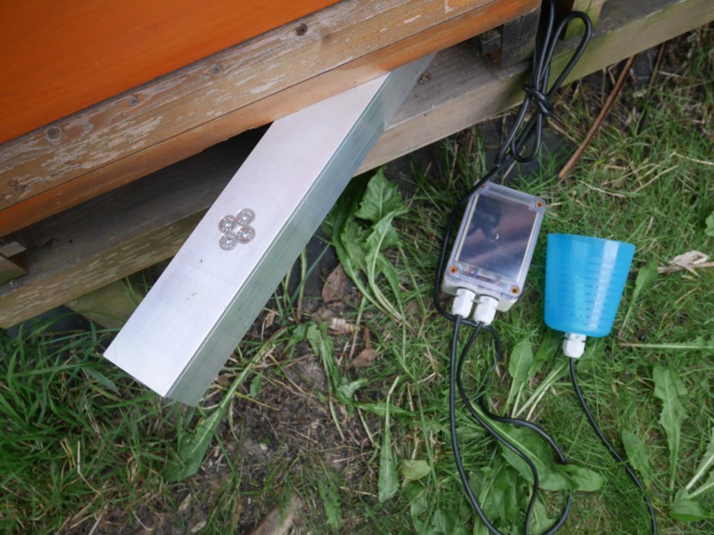

# TanenBase — Smart Hive Monitoring

[](LICENSE)
[](https://www.seeedstudio.com/)
[](https://developer.nordicsemi.com/)

A LoRaWAN beehive monitor that runs for years on a single AA-sized primary cell.

It weighs the hive, reads its temperature, and reports over LoRaWAN to The Things
Network — then sleeps at about **4 µA**. Configuration and calibration happen
over Bluetooth from a web page, so there is no mobile app to install and nothing
to plug in once the lid is closed.

| | |
|---|---|
| **MCU** | Seeed Studio XIAO nRF54LM20A (Standard, non-Sense) |
| **Radio** | Wio-SX1262 LoRa kit — LoRaWAN Class A, OTAA, EU868 |
| **Sensors** | NAU7802 24-bit load-cell ADC · DS18B20 temperature · nPM1300 battery gauge |
| **RTOS / SDK** | Zephyr 4.4 via nRF Connect SDK v3.4.0 |
| **Sleep current** | ~4 µA (System OFF + GRTC wake) |
| **Battery life** | ~9 years on an ER14505 AA Li-SOCl₂ at 15 min / 2 h reporting |
| **Uplink** | 8 bytes — weight (999 kg range), temperature, battery, flags |



*A node in the field: the load-cell bar slides under the hive, the enclosure
holds the electronics and the AA cell, and the temperature probe runs inside.*

📺 **[Build workshop walkthrough (YouTube)](https://www.youtube.com/watch?v=t2ags30G7-o)**

---

## How it works

The firmware is a **single-pass state machine**, not a loop. Every wake is a cold
boot from System OFF: it checks why it woke, does one pass, and powers off again.

```
       wake reason
            │
    ┌───────▼────────┐  button / reset
    │     SETUP      │  BLE config service, sensors live, 180 s window
    └───────┬────────┘
            │
    ┌───────▼────────┐  timer
    │  MEASUREMENT   │  weight + temp + battery, anomaly check
    └───────┬────────┘
            │ delta exceeded, or heartbeat due?
    ┌───────▼────────┐  yes
    │  TRANSMISSION  │  power up SX1262, join if needed, uplink, sleep radio
    └───────┬────────┘
            │
    ┌───────▼────────┐
    │     SLEEP      │  System OFF, GRTC timed wake
    └────────────────┘
```

The radio is only powered when there is something to send. Between heartbeats
the node measures, compares against the last transmitted values, and goes back
to sleep without ever touching the SX1262 — which is where most of the battery
life comes from.

Full design notes: [`docs/ARCHITECTURE.md`](docs/ARCHITECTURE.md).

---

## Repository layout

| Path | What it is |
|------|------------|
| [`src/`](src/) | Firmware — `core/` (FSM, power, watchdog), `drivers/`, `features/`, `config/` |
| [`boards/`](boards/) | Application devicetree overlay for the target board |
| [`third_party/`](third_party/) | Vendored Seeed XIAO nRF54LM20A board definition (Apache-2.0) |
| [`Tanen_Base_pcb/`](Tanen_Base_pcb/) | KiCad carrier board — schematic, layout, gerbers |
| [`web/`](web/) | Web Bluetooth configuration page (single file, no build step) |
| [`ttndecoder/`](ttndecoder/) | TTN payload formatters — BEEP and custom |
| [`test_apps/measure_loop/`](test_apps/measure_loop/) | Standalone sensor bring-up app |
| [`docs/`](docs/) | Architecture, power budget, sprint log, TRD, open questions |

---

## Building

**Requires** nRF Connect SDK **v3.4.0** and its bundled toolchain. The board
definition is out-of-tree and vendored, so no `west update` of extra manifests is
needed.

```powershell
git clone https://github.com/<you>/TanenBase.git
cd TanenBase

# LoRaWAN credentials — never commit the real one
Copy-Item prj_credentials.conf.example prj_credentials.conf
#   then edit it and set your AppKey

.\build.ps1 debug        # logs on uart20 -> on-board CMSIS-DAP VCOM @115200
.\build.ps1 prod         # LOG off, size-optimized
.\flash_update.ps1       # flash, preserving stored config + calibration
```

`build.ps1` finds the SDK automatically (newest `vX.Y.Z` under `C:\ncs`). Override
with `$env:NCS_ROOT`, `$env:NCS_VERSION`, or `$env:NCS_TOOLCHAIN` if your install
lives elsewhere. On a mode change it forces `--pristine` for you, because
switching in place trips a stale-CMakeCache Kconfig failure.

Raw `west` equivalent, if you prefer:

```sh
west build -b xiao_nrf54lm20a/nrf54lm20a/cpuapp --no-sysbuild -- \
    -DBOARD_ROOT=$PWD/third_party/seeed-xiao-nrf54lm20a \
    -DOVERLAY_CONFIG="prj_credentials.conf;prj_production.conf"
```

**Gotchas worth knowing before your first build** — see
[`docs/PLAN.md`](docs/PLAN.md) Sprint 15 for the full list:

- Keep the build directory path **short** on Windows (MAX_PATH kills ninja).
- Do **not** add `-S cdc-acm-console`. It repoints the console at the nRF's own
  USBHS CDC, which never enumerates on this board — you get silence.
- pyocd cannot program the nRF54LM20A: its erase works, then its flash algorithm
  hard-faults and leaves the chip blank. Use OpenOCD (what `flash_*.ps1` do) or
  `west flash`.

---

## Provisioning a node

1. Flash, then press the user button to enter **SETUP**. The node advertises as
   `TanenBase` for 180 seconds.
2. Open [`web/index.html`](web/index.html) in Chrome or Edge (Web Bluetooth;
   Safari and Firefox do not support it) and connect.
3. Write the DevEUI, JoinEUI, and AppKey from your TTN device registration.
4. Tare the empty scale, then calibrate with a known reference weight.
5. Set the measurement and transmit intervals, and the anomaly thresholds.
6. Press **Done**. The node joins TTN and enters its normal cycle.

Everything above is also settable later by LoRaWAN downlink (FPort 10–13) and
persists in ZMS across reboots and firmware updates.

**Each physical unit needs its own DevEUI.** Leave `CONFIG_TANENBASE_DEV_EUI`
empty to derive a unique one from the SoC's factory hardware ID.

### The Things Network

Register the device as **LoRaWAN MAC v1.0.3**, OTAA, EU868. Install one of the
payload formatters from [`ttndecoder/`](ttndecoder/).

If you forward to [BEEP](https://beep.nl), the webhook base URL **must** carry
the device key explicitly:

```
https://api.beep.nl/api/lora_sensors?key=<DevEUI>
```

Without it BEEP decodes your payload perfectly and then silently drops it,
because it falls back to a TTN Stack **V2** field (`payload_fields.hardware_serial`)
that V3 webhooks do not send. This one cost real debugging time — see
[`docs/PLAN.md`](docs/PLAN.md) Sprint 14.

---

## Hardware

The carrier board is a passive breakout: XIAO socket, Wio-SX1262 socket, screw
terminals for the load cell and the DS18B20, battery input, and the bulk
capacitor. KiCad sources and fabricated gerbers are in
[`Tanen_Base_pcb/`](Tanen_Base_pcb/).


*Assembled in an IP-rated enclosure — XIAO nRF54LM20A top-left, NAU7802
load-cell amplifier on the right, external 868 MHz antenna, and cable glands for
the load cell and temperature probe.*

> The KiCad project files are still named **XIAO_nRF54L15 V1**, while the board
> itself is silkscreened *Tanen Base v0.1*. That is deliberate: all XIAO modules
> share one 21 × 17.5 mm footprint and pinout, so the nRF54L15 and nRF54LM20A are
> drop-in replacements on this carrier — only the GPIO number behind each header
> pin changes, and that is handled in the devicetree overlay.
> [`Tanen_Base_pcb/README.md`](Tanen_Base_pcb/README.md) has the full pin-by-pin
> mapping.

**Battery:** ER14505 AA Li-SOCl₂, **primary / non-rechargeable**. The firmware
deliberately deletes `charging-enable` from the nPM1300 charger node — with it
armed, applying USB power would push charge current into a non-rechargeable
lithium cell. Do not re-enable it unless you have also changed the cell.
[`docs/POWER_BUDGET.md`](docs/POWER_BUDGET.md) covers the cell selection, the
2.3–4.45 V input window, and the pulse-current margin.

---

## Status

Running in the field. The core loop — measure, delta-detect, uplink, sleep — is
verified end to end on hardware, including BEEP ingestion.

Not yet done: MCUboot/OTA is wired up (`sysbuild.conf`, `pm_static.yml`) but
**unverified on this module**, and no production signing key is provisioned.
Open design questions are tracked in
[`docs/OPEN_QUESTIONS.md`](docs/OPEN_QUESTIONS.md).

---

## Contributing

See [CONTRIBUTING.md](CONTRIBUTING.md). Bug reports and hardware notes from
anyone running this on real hives are especially welcome.

---

## Credits

**Hussein Daj** — project owner, product design, hardware design (carrier PCB,
sensor selection, power architecture), firmware direction, and all hardware
bring-up, PPK2 power measurement, and field validation.

**[Claude Code](https://claude.com/claude-code)** (Anthropic) — firmware
co-development. Worked alongside the author on the state machine, drivers,
BLE GATT service, power-management path, watchdog and fault-tolerance layer, the
nRF54L15 → nRF54LM20A port, and this documentation. Every change was reviewed and
hardware-verified by the author before it landed.

**[Google Gemini](https://gemini.google.com)** — product design input:
requirements shaping, use-case analysis, and design-decision review during the
concept and specification phase.

### Third-party work this builds on

- [Zephyr RTOS](https://zephyrproject.org) and the
  [nRF Connect SDK](https://developer.nordicsemi.com) — Apache-2.0
- [Seeed Studio](https://github.com/Seeed-Studio/platform-seeedboards) — XIAO
  nRF54LM20A Zephyr board definition, vendored in
  [`third_party/`](third_party/) — Apache-2.0
- [loramac-node](https://github.com/Lora-net/LoRaMac-node) — LoRaWAN MAC
- [BEEP](https://beep.nl) — open beehive monitoring platform and data API

---

## License

Apache-2.0 — see [LICENSE](LICENSE) and [NOTICE](NOTICE). This covers the
firmware, the hardware design files, and the documentation.
