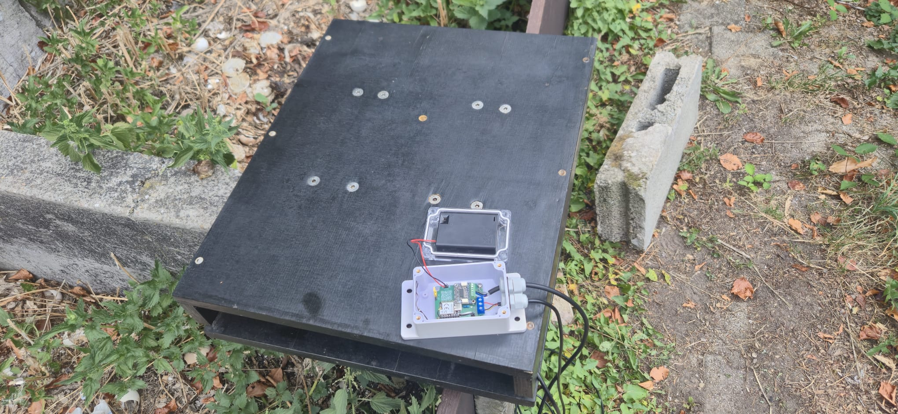
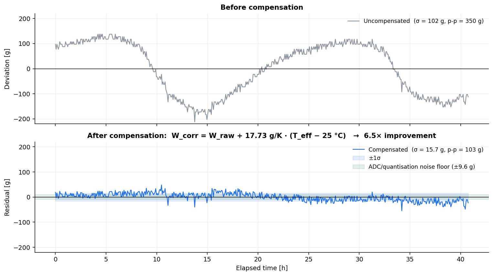
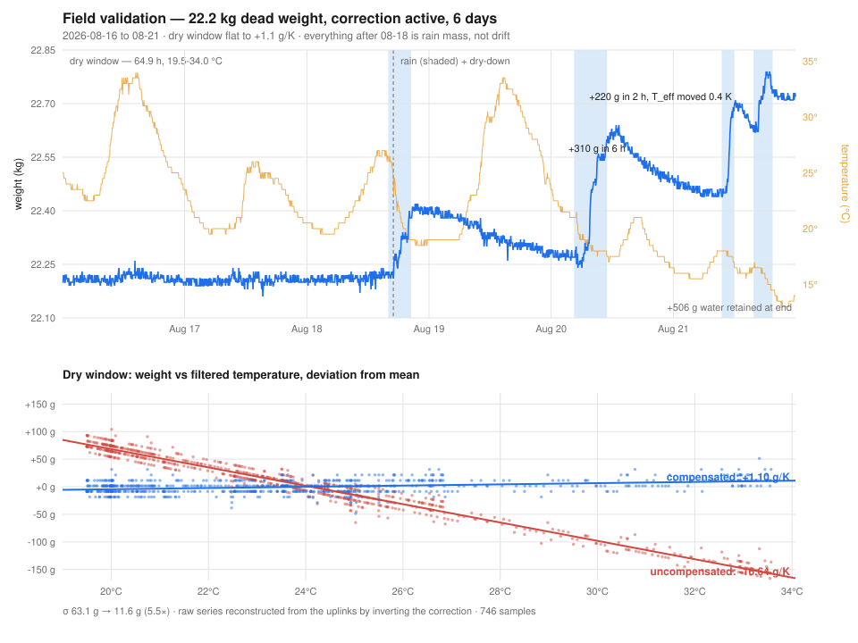
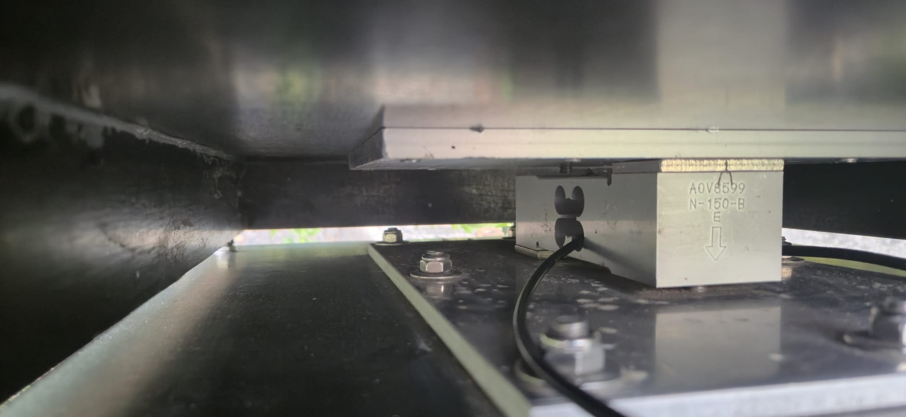
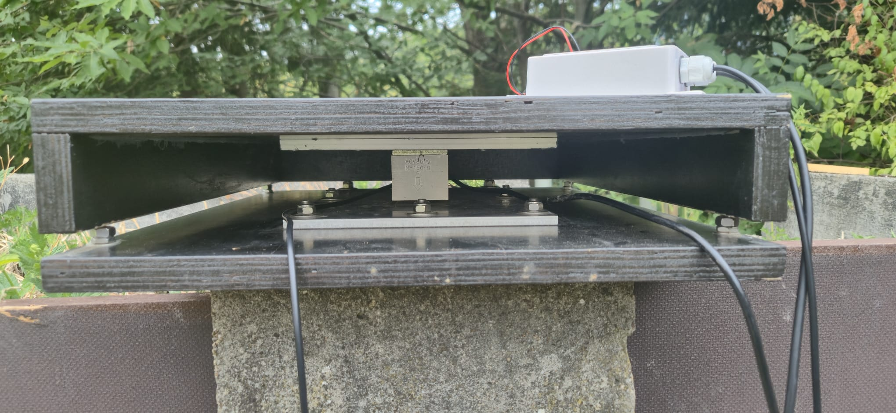
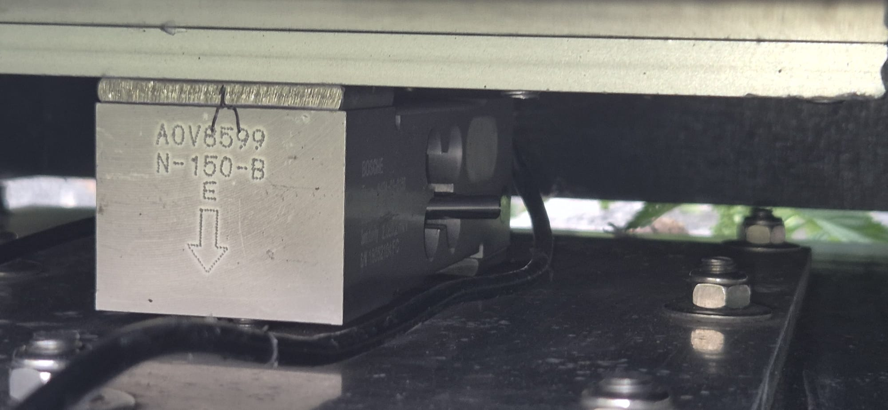

# TanenBase — Smart Hive Monitoring

[](LICENSE)
[](https://www.seeedstudio.com/)
[](https://developer.nordicsemi.com/)

A LoRaWAN beehive monitor that runs for years on three AAA primary lithium cells.

It weighs the hive, reads its temperature, and reports over LoRaWAN to The Things
Network — then sleeps at about **4 µA**. Configuration and calibration happen
over Bluetooth from a web page, so there is no mobile app to install and nothing
to plug in once the lid is closed.

| | |
|---|---|
| **MCU** | Seeed Studio XIAO nRF54LM20A (Standard, non-Sense) |
| **Radio** | Wio-SX1262 LoRa kit — LoRaWAN Class A, OTAA, EU868 |
| **Sensors** | NAU7802 24-bit load-cell ADC · DS18B20 temperature · nPM1300 battery gauge |
| **RTOS / SDK** | Zephyr 4.4 via nRF Connect SDK v3.4.0 |
| **Sleep current** | ~4 µA (System OFF + GRTC wake) |
| **Battery life** | ~4.6 years on 3× AAA Li/FeS₂ (1200 mAh) at 15 min / 2 h reporting — ~10 y at 60 min / 4 h |
| **Uplink** | 8 bytes — weight (999 kg range), temperature, battery, flags |



*A node in the field: the hive stands on the platform, the IP-rated enclosure
bolted to it holds the electronics and the battery pack, and the temperature probe
runs inside the hive.*

📺 **[Build workshop walkthrough (YouTube)](https://www.youtube.com/watch?v=t2ags30G7-o)** ·
🎬 **[Bench test clip](media/test.mp4)** (download — GitHub does not play repo-hosted video inline)

---

## How it works

The firmware is a **single-pass state machine**, not a loop. Every wake is a cold
boot from System OFF: it checks why it woke, does one pass, and powers off again.

```
       wake reason
            │
    ┌───────▼────────┐  button / reset
    │     SETUP      │  BLE config service, sensors live, 180 s window
    └───────┬────────┘
            │
    ┌───────▼────────┐  timer
    │  MEASUREMENT   │  weight + temp + battery, anomaly check
    └───────┬────────┘
            │ delta exceeded, or heartbeat due?
    ┌───────▼────────┐  yes
    │  TRANSMISSION  │  power up SX1262, join if needed, uplink, sleep radio
    └───────┬────────┘
            │
    ┌───────▼────────┐
    │     SLEEP      │  System OFF, GRTC timed wake
    └────────────────┘
```

The radio is only powered when there is something to send. Between heartbeats
the node measures, compares against the last transmitted values, and goes back
to sleep without ever touching the SX1262 — which is where most of the battery
life comes from.

Full design notes: [`docs/ARCHITECTURE.md`](docs/ARCHITECTURE.md).

### Temperature compensation

A hive scale's real enemy is not resolution, it is thermal drift. Uncompensated,
the reference cell reports a **350 g peak-to-peak swing on a constant 22 kg
load** over a 17.5 K daily cycle — 16 g of phantom weight per kelvin, enough to
bury a real nectar flow.

The firmware corrects it with two parameters: one gain constant, plus a
first-order lag filter on the probe temperature that models the probe sitting a
few minutes behind the aluminium cell body. Residual scatter drops **6.5×, to
σ = 15.7 g**. The filtered temperature is carried in ZMS across System OFF, and
the tare stores the temperature it ran at as the correction's reference point.



*Same 22 kg load, 40.7 h, one daily temperature cycle. σ 102.2 g → 15.7 g,
peak-to-peak 350 g → 103 g.*

**Validated in the field**, not just on the bench: six days outdoors with a
22.2 kg dead weight and the correction live left **+1.10 g/K** of temperature
sensitivity where the uncompensated cell had −16.6, and σ of 11.6 g against
63.1 g — measured on the *same samples*, by reconstructing the filter offline
and inverting the correction.



*Days 4–6 are rain, not drift: +220 g arrived in two hours while the filtered
temperature moved 0.4 K, and 506 g of water was still in the wooden platform and
the concrete block at the end. Once the drying trend is modelled, the residual
thermal term across those days is +0.56 and −1.48 g/K — the correction holds
underneath the water.*



*The cell the coefficient was fitted on — a Bosche H40A-C3-0150 single-point
cell bolted between two steel spreader plates. Worth staring at: the report
concludes the drift is **not** coming from the cell but from this mount, which
is 8× outside the OIML R60 envelope the cell is certified to.*

`k` is a property of the **cell plus its mount**, not of the cell alone —
re-characterise after any mechanical change, override with
`CONFIG_TANENBASE_TEMPCOMP_GAIN_MG_PER_K`, or set it to `0` to disable. Method,
data, hold-out validation and the (unflattering) hardware conclusions:
[`docs/load_cells/H40A-C3-0150/`](docs/load_cells/H40A-C3-0150/).

---

## Repository layout

| Path | What it is |
|------|------------|
| [`src/`](src/) | Firmware — `core/` (FSM, power, watchdog), `drivers/`, `features/`, `config/` |
| [`boards/`](boards/) | Application devicetree overlay for the target board |
| [`third_party/`](third_party/) | Vendored Seeed XIAO nRF54LM20A board definition (Apache-2.0) |
| [`Tanen_Base_pcb/`](Tanen_Base_pcb/) | KiCad carrier board — schematic, layout, gerbers |
| [`web/`](web/) | Web Bluetooth configuration page + standalone downlink encoder (no build step) |
| [`ttndecoder/`](ttndecoder/) | TTN payload formatters — one unified BEEP + beelogger decoder, plus the older per-platform ones |
| [`test_apps/measure_loop/`](test_apps/measure_loop/) | Standalone sensor bring-up app |
| [`docs/`](docs/) | Architecture, power budget, sprint log, TRD, open questions, German user manual (`BENUTZERHANDBUCH.md` + built HTML) |
| [`docs/load_cells/`](docs/load_cells/) | Load-cell characterisation — data, analysis, host replay of the compensation |
| [`media/`](media/) | Build photos and a bench-test clip |

---

## Building

**Requires** nRF Connect SDK **v3.4.0** and its bundled toolchain. The board
definition is out-of-tree and vendored, so no `west update` of extra manifests is
needed.

```powershell
git clone https://github.com/hmd83/tanen.git
cd tanen

# LoRaWAN credentials — never commit the real one
Copy-Item prj_credentials.conf.example prj_credentials.conf
#   then edit it and set your AppKey

.\build.ps1 debug        # logs on uart20 -> on-board CMSIS-DAP VCOM @115200
.\build.ps1 prod         # LOG off, size-optimized
.\flash_update.ps1       # flash, preserving stored config + calibration
```

`build.ps1` finds the SDK automatically (newest `vX.Y.Z` under `C:\ncs`). Override
with `$env:NCS_ROOT`, `$env:NCS_VERSION`, or `$env:NCS_TOOLCHAIN` if your install
lives elsewhere. On a mode change it forces `--pristine` for you, because
switching in place trips a stale-CMakeCache Kconfig failure.

Raw `west` equivalent, if you prefer:

```sh
west build -b xiao_nrf54lm20a/nrf54lm20a/cpuapp --no-sysbuild -- \
    -DBOARD_ROOT=$PWD/third_party/seeed-xiao-nrf54lm20a \
    -DOVERLAY_CONFIG="prj_credentials.conf;prj_production.conf"
```

**Gotchas worth knowing before your first build** — see
[`docs/PLAN.md`](docs/PLAN.md) Sprint 15 for the full list:

- Keep the build directory path **short** on Windows (MAX_PATH kills ninja).
- Do **not** add `-S cdc-acm-console`. It repoints the console at the nRF's own
  USBHS CDC, which never enumerates on this board — you get silence.
- pyocd cannot program the nRF54LM20A: its erase works, then its flash algorithm
  hard-faults and leaves the chip blank. Use OpenOCD (what `flash_*.ps1` do) or
  `west flash`.

---

## Provisioning a node

1. Flash, then press the user button to enter **SETUP**. The node advertises as
   `TanenBase` for 180 seconds.
2. Open [`web/index.html`](web/index.html) in Chrome or Edge (Web Bluetooth;
   Safari and Firefox do not support it) and connect.
3. Write the DevEUI, JoinEUI, and AppKey from your TTN device registration.
4. Tare the empty scale, then calibrate with a known reference weight. The tare
   also records the temperature it ran at — that becomes the reference point of
   the thermal correction, so tare at a temperature the hive actually sees.
5. Set the measurement and transmit intervals, and the anomaly thresholds.
6. Press **Done**. The node joins TTN and enters its normal cycle.

Everything above is also settable later by LoRaWAN downlink (FPort 10–13) and
persists in ZMS across reboots and firmware updates.
[`web/encoder.html`](web/encoder.html) builds those downlinks — pick the
parameter, type the value in human units, and copy the fPort plus hex/base64 for
the TTN console, or the whole `down/push` body for the TTN API. It is a separate
page with no Bluetooth at all, so it needs neither the node nor a pairing.

**Each physical unit needs its own DevEUI.** Leave `CONFIG_TANENBASE_DEV_EUI`
empty to derive a unique one from the SoC's factory hardware ID.

### The Things Network

Register the device as **LoRaWAN MAC v1.0.3**, OTAA, EU868, then install
[`ttndecoder/tanen-decoder.js`](ttndecoder/tanen-decoder.js) as the uplink
payload formatter (Payload formatters → Uplink → Custom Javascript formatter).

One formatter serves both supported platforms: it parses the 8-byte frame once
and emits both key sets into the same `decoded_payload`.

| Reading | BEEP key | beelogger key | Unit |
|---|---|---|---|
| Weight | `weight_kg` | `Gewicht` | kg |
| Temperature | `t` | `TempOut` | °C |
| Battery | `bv` | `VBatt` | V |

Each platform stores the keys it knows and ignores the rest, so no per-platform
formatter juggling is needed. A failed sensor decodes to `null` on both sides,
never to a sentinel number. `flags`, `anomaly_weight`, `anomaly_temp` and
`heartbeat` ride along for TTN live-data debugging and are ignored by both
servers. The older single-platform formatters
([`beepdecoder.js`](ttndecoder/beepdecoder.js),
[`tanen-beelogger-decoder.js`](ttndecoder/tanen-beelogger-decoder.js)) are kept
for reference.

**BEEP** ([beep.nl](https://beep.nl)) — the webhook base URL **must** carry the
device key explicitly:

```
https://api.beep.nl/api/lora_sensors?key=<DevEUI>
```

Without it BEEP decodes your payload perfectly and then silently drops it,
because it falls back to a TTN Stack **V2** field (`payload_fields.hardware_serial`)
that V3 webhooks do not send. This one cost real debugging time — see
[`docs/PLAN.md`](docs/PLAN.md) Sprint 14.

**beelogger** ([beelogger.de](https://beelogger.de)) — the community server
takes the `Gewicht` / `TempOut` / `VBatt` names its own payload formatter uses,
which is exactly what the decoder emits. Webhook base URL:

```
https://community.beelogger.de/<username>/{/devID}/beelogger_log.php?Passwort=<password>&LORA=1
```

- `<username>` — your community-server account
- `{/devID}` — filled in by TTN per uplink, so name the TTN devices
  `beelogger1`, `beelogger2`, … to match the stations registered on the server
- `<password>` — the same one for every station, which is what lets a **single
  webhook serve the whole TTN application** instead of one per node
- `LORA=1` — tells the server the record arrives via LoRaWAN

Both platforms are confirmed receiving from the unified decoder.

---

## Hardware

The carrier board is a passive breakout: XIAO socket, Wio-SX1262 socket, screw
terminals for the load cell and the DS18B20, battery input, and the bulk
capacitor. KiCad sources and fabricated gerbers are in
[`Tanen_Base_pcb/`](Tanen_Base_pcb/).


*Assembled in an IP-rated enclosure — XIAO nRF54LM20A top-left, NAU7802
load-cell amplifier on the right, external 868 MHz antenna, and cable glands for
the load cell and temperature probe.*



*The weighing platform end-on: a single-point cell carries the whole top frame
from the centre, so the hive can sit anywhere on it without changing the
reading. Enclosure sits on the top deck, cable runs down to the cell.*



*Underside — the cell between the top plate and the base, load arrow pointing
down. E<sub>max</sub> = 150 kg, which is oversized for a hive: a 100 kg cell
would give ~1.5× better signal-to-noise at the same absolute drift.*

> The KiCad project files are still named **XIAO_nRF54L15 V1**, while the board
> itself is silkscreened *Tanen Base v0.1*. That is deliberate: all XIAO modules
> share one 21 × 17.5 mm footprint and pinout, so the nRF54L15 and nRF54LM20A are
> drop-in replacements on this carrier — only the GPIO number behind each header
> pin changes, and that is handled in the devicetree overlay.
> [`Tanen_Base_pcb/README.md`](Tanen_Base_pcb/README.md) has the full pin-by-pin
> mapping.

**Battery:** 3× BEVIGOR AAA 1.5 V lithium (Li/FeS₂, 1200 mAh) in series —
4.5 V nominal, **5.2 V measured fresh at room temperature** — **primary /
non-rechargeable**. The firmware
deliberately deletes `charging-enable` from the nPM1300 charger node; with it
armed, applying USB power would push charge current into non-rechargeable cells.
Do not re-enable it unless you have also changed the chemistry.

⚠️ **The pack sits above the nPM1300's recommended VBAT maximum for
essentially its whole life.** The window is 2.3–4.45 V recommended, 5.5 V
absolute. At µA drain Li/FeS₂ holds a ~1.79 V/cell plateau that is nearly
independent of depth of discharge and **rises with temperature**, so the pack
only drops back inside the recommended range as the cells die. Worst case is a
warm hive with cells at the top of the 1.79–1.83 V fresh spread: **5.49 V against
a 5.5 V absolute maximum.** This is a deliberate, documented deviation — see
[`docs/POWER_BUDGET.md`](docs/POWER_BUDGET.md) §5.2 for the chemistry data,
mitigations, the ER14505 AA Li-SOCl₂ cell this replaced, and what the swap bought
(no passivation, −40 °C rating, large pulse margin) and cost (9.3 y → 4.6 y).

Measure cells before assembly and reject any above ~1.80 V; keep the enclosure
out of direct sun.

---

## Status

Running in the field. The core loop — measure, delta-detect, uplink, sleep — is
verified end to end on hardware, including ingestion by both BEEP and the
beelogger community server from the same uplink.

Not yet done: MCUboot/OTA is wired up (`sysbuild.conf`, `pm_static.yml`) but
**unverified on this module**, and no production signing key is provisioned.
Open design questions are tracked in
[`docs/OPEN_QUESTIONS.md`](docs/OPEN_QUESTIONS.md).

---

## Contributing

See [CONTRIBUTING.md](CONTRIBUTING.md). Bug reports and hardware notes from
anyone running this on real hives are especially welcome.

---

## Credits

**Hussein Daj** — project owner, product design, hardware design (carrier PCB,
sensor selection, power architecture), firmware direction, and all hardware
bring-up, PPK2 power measurement, and field validation.

**[Claude Code](https://claude.com/claude-code)** (Anthropic) — firmware
co-development. Worked alongside the author on the state machine, drivers,
BLE GATT service, power-management path, watchdog and fault-tolerance layer, the
nRF54L15 → nRF54LM20A port, the load-cell temperature-drift analysis and the
compensation formula it produced, and this documentation. Every change was
reviewed and hardware-verified by the author before it landed.

**[Google Gemini](https://gemini.google.com)** — product design input:
requirements shaping, use-case analysis, and design-decision review during the
concept and specification phase.

### Third-party work this builds on

- [Zephyr RTOS](https://zephyrproject.org) and the
  [nRF Connect SDK](https://developer.nordicsemi.com) — Apache-2.0
- [Seeed Studio](https://github.com/Seeed-Studio/platform-seeedboards) — XIAO
  nRF54LM20A Zephyr board definition, vendored in
  [`third_party/`](third_party/) — Apache-2.0
- [loramac-node](https://github.com/Lora-net/LoRaMac-node) — LoRaWAN MAC
- [BEEP](https://beep.nl) — open beehive monitoring platform and data API
- [beelogger](https://beelogger.de) — open hive-scale project and community
  server; its field names are mirrored by the uplink decoder

---

## License

Apache-2.0 — see [LICENSE](LICENSE) and [NOTICE](NOTICE). This covers the
firmware, the hardware design files, and the documentation.
