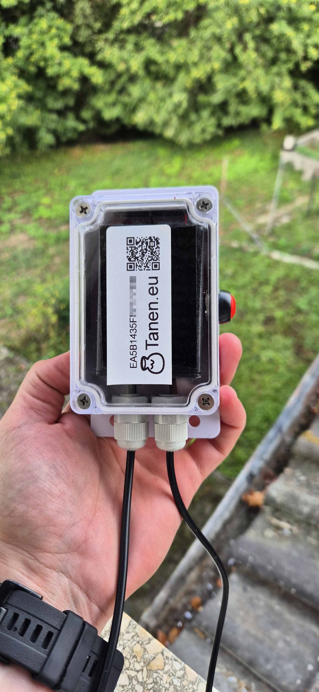
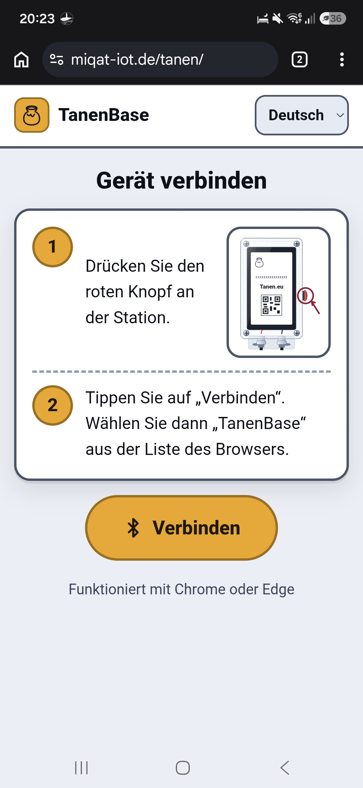
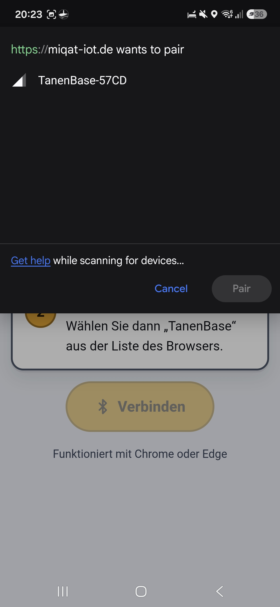
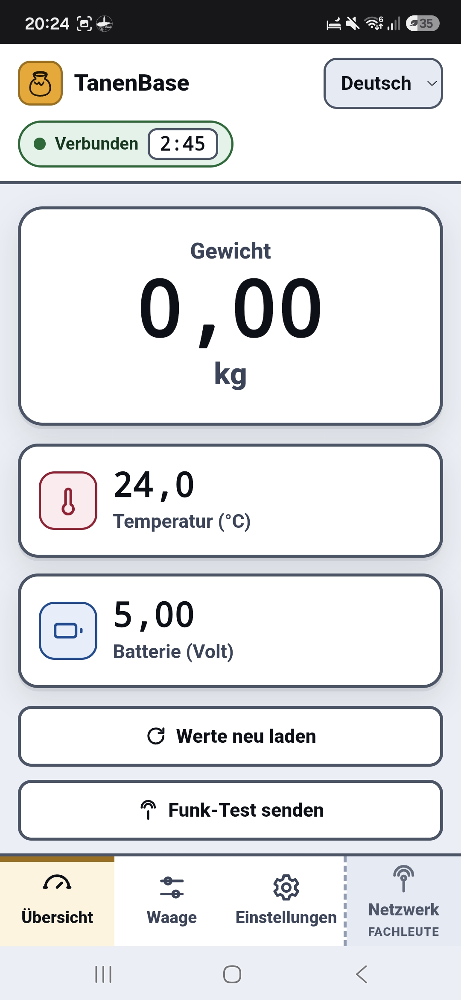
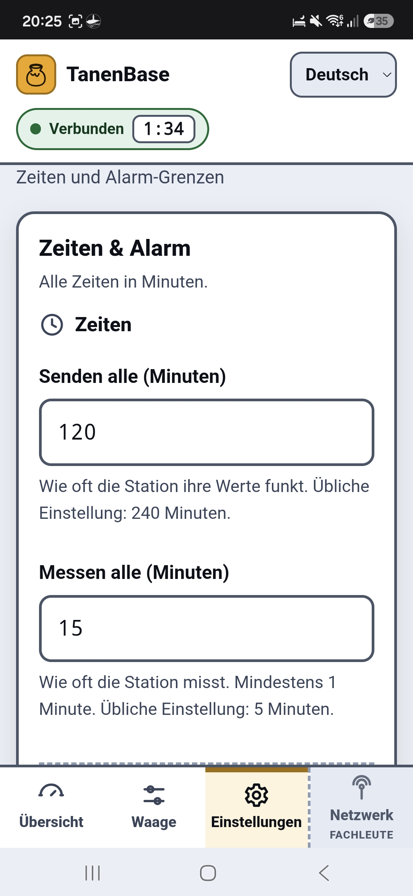
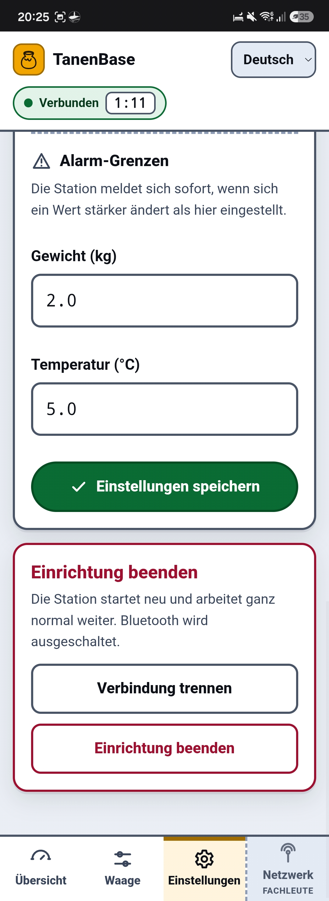
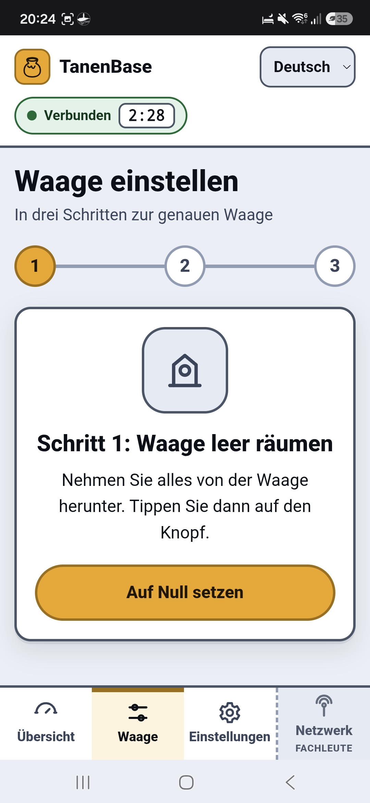
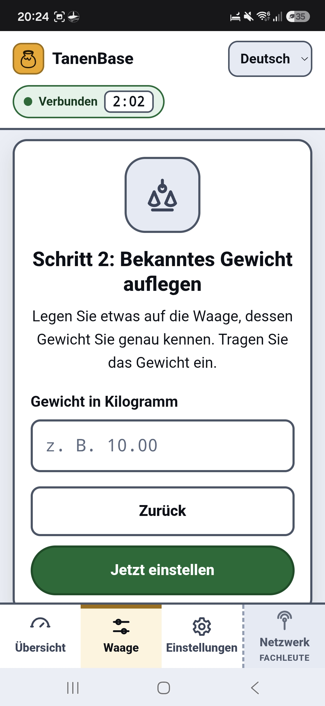
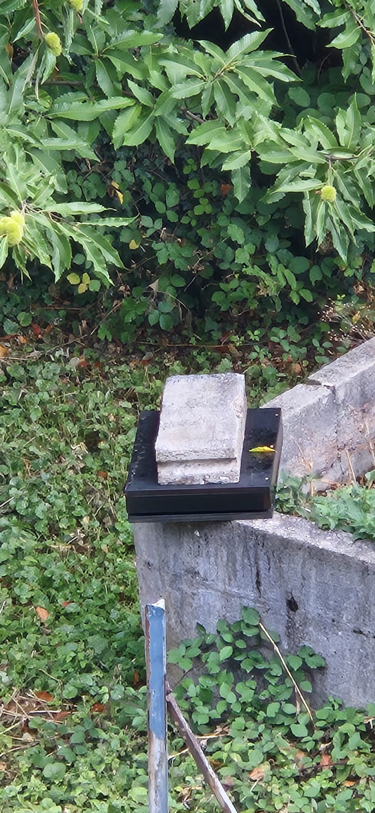
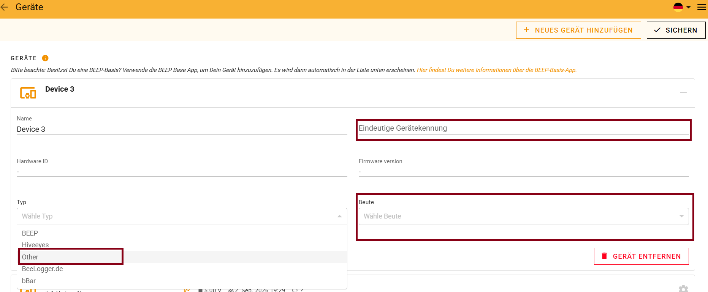

# TanenBase Stockwaage — Benutzerhandbuch

**Für Imkerinnen und Imker. Ohne Technikkenntnisse.**

Dieses Handbuch führt Sie durch Aufbau, Montage, Einrichtung und Kalibrierung
Ihrer TanenBase Stockwaage. Sie brauchen dafür kein Elektronikwissen und keine
App.

---

## Inhalt

1. [Vorbereitung & Hardware-Überblick](#1-vorbereitung--hardware-überblick)
2. [Montage am Bienenstock](#2-montage-am-bienenstock)
3. [Erstinbetriebnahme & Web-Interface](#3-erstinbetriebnahme--web-interface)
4. [Kalibrierung der Waage](#4-kalibrierung-der-waage)
5. [Fehlerbehebung & Pflege](#5-fehlerbehebung--pflege)
6. [Anbindung an eine Auswerteplattform (optional)](#6-anbindung-an-eine-auswerteplattform-optional)

---

## 1. Vorbereitung & Hardware-Überblick

### Was die Waage für Sie tut

Die TanenBase steht unter Ihrem Bienenstock und macht drei Dinge:

- Sie **wiegt** den Stock — auf wenige Gramm genau.
- Sie **misst die Temperatur**.
- Sie **funkt** die Werte in regelmäßigen Abständen zu Ihnen — ohne Kabel und
  ohne Mobilfunkvertrag.

So sehen Sie von zu Hause aus, ob der Nektar fließt, ob geschwärmt wurde oder ob
ein Volk plötzlich leichter wird — ohne den Stock zu öffnen.

Zwischen den Messungen schläft die Station fast vollständig. Ein Satz Batterien
hält deshalb **rund viereinhalb Jahre** — bei einer Messung alle 15 Minuten und
einer Meldung alle zwei Stunden. Wer seltener messen und melden lässt, kommt auf
deutlich mehr: bei stündlicher Messung und Meldung alle vier Stunden sind es
rechnerisch etwa zehn Jahre.

> **Wichtig:** Die Station braucht **keinen Netzstrom** und **kein WLAN**. Nur
> die eingelegten Batterien und Funkempfang am Standort.

### Die Teile im Überblick

| Teil | Wozu |
|------|------|
| **Wägezelle** (Bosche H40A-C3-0150) | Der eigentliche Gewichtssensor. Sitzt mittig unter der Waage. |
| **Waagengestell** | Zwei Platten (oben/unten), zwischen denen die Wägezelle sitzt. Selbst gebaut oder fertig gekauft. |
| **Elektronik-Gehäuse** | Wetterfeste Box mit durchsichtigem Deckel. Darin steckt die Technik. |
| **Roter Knopf** | Seitlich am Gehäuse. Damit starten Sie die Einrichtung. |
| **Aufkleber mit QR-Code** | Auf der Box. Enthält die Gerätenummer (**DevEUI**) Ihrer Station. |
| **Zwei Kabelverschraubungen** | Unten an der Box. Hier gehen die Kabel wasserdicht heraus. |
| **Temperaturfühler** | Wasserdichter Fühler am Kabel. Kommt an die Wägezelle (siehe Kapitel 2.4). |
| **Batterien** — 3 × AAA Lithium (1,5 V, 1200 mAh, z. B. BEVIGOR) | Versorgen alles. In Reihe ergeben sie **frisch rund 5,2 Volt**. **Nicht aufladbar!** |
| **Antenne** | Liegt im Gehäuse. Nicht knicken, nicht mit Metall abdecken. |

> **[Bild 1: Die geschlossene Station]** — Gut zu sehen: der **rote Knopf**
> rechts am Gehäuse, der Aufkleber mit **QR-Code und Gerätenummer**
> („EA5B1435F…") und die **zwei Kabelverschraubungen** unten, aus denen die
> beiden schwarzen Kabel kommen.

> **[Bild 2: Blick in die geöffnete Station]** — Nur für den Notfall wichtig.
> Sie sehen die Platine, den kleinen Schiebeschalter **„OFF / ON"** oben rechts,
> die **blaue Klemme** für den Temperaturfühler und die **grüne Klemme** für die
> Wägezelle. Im Normalbetrieb bleibt der Deckel zu.

> **[Bild 3: Die Wägezelle aus der Nähe]** — Auf dem hellen Aluminiumblock steht
> die Nummer **N-150-B** und darunter ein **Pfeil nach unten (⇓)**. Dieser Pfeil
> muss beim Einbau nach unten zeigen. Merken Sie sich das — es ist der häufigste
> Montagefehler.

> **[Bild 4: Die fertige Waage im Feld]** — Schwarz lackierte Holzplattform, das
> Elektronik-Gehäuse ist an der Kante festgeschraubt, die Kabel laufen nach unten.

### Was Sie zusätzlich brauchen

**Werkzeug**

- Schraubendreher (Kreuzschlitz) und Schraubenschlüssel
- **Wasserwaage** — unbedingt nötig
- Kabelbinder
- Optional: Aluminium-Klebeband und etwas Wärmeleitpaste für den Temperaturfühler

**Zum Kalibrieren**

- Ein **Gewicht, das Sie genau kennen** — z. B. ein voller 10-Liter-Wasserkanister
  (10 Liter Wasser = 10,0 kg) oder ein abgewogener Betonstein.
- Je schwerer, desto genauer. **10 bis 25 kg** sind ideal.

**Zum Einrichten**

- Ein **Android-Handy** oder ein **Laptop** (Windows / Mac / Linux)
- Darauf der Browser **Chrome** oder **Edge**

> ⚠️ **iPhone und iPad funktionieren nicht.** Safari und Firefox ebenfalls nicht.
> Diese Browser können die Bluetooth-Verbindung zur Station technisch nicht
> aufbauen. Leihen Sie sich für die Einrichtung ein Android-Gerät oder nehmen Sie
> einen Laptop mit.

### Sicherheitshinweise

- Es sind **Lithium-Primärzellen. Niemals laden.** Nicht öffnen, nicht ins Feuer
  werfen, nicht kurzschließen.
- **Immer alle drei Zellen gemeinsam wechseln** und nie alte mit neuen mischen.
- Schließen Sie **kein USB-Kabel** an, solange die Batterien eingelegt sind.
- Stellen Sie das Gehäuse **nicht in die pralle Sonne**. Im Schatten unter der
  Plattform bleibt die Elektronik kühler und die Batteriespannung niedriger.
- **Nicht auf die Plattform steigen.** Das nimmt Ihnen die Wägezelle übel.
- Die Waage ist wetterfest, aber **kein Tauchgerät**. Nicht mit dem
  Hochdruckreiniger abspritzen.

---

## 2. Montage am Bienenstock

### 2.1 Das Prinzip in einem Satz

In der **Mitte** zwischen zwei Platten sitzt **eine einzige Wägezelle**, die die
komplette obere Platte trägt. Deshalb ist es egal, wo genau auf der Plattform der
Stock steht — das Gewicht stimmt trotzdem.

Diese Bauart heißt **Single-Point-Zelle**. Sie ist der Grund, warum die Waage so
einfach zu bauen ist.

> **[Bild 5: Der Aufbau von der Seite]** — Sehr gut zu erkennen: unten die
> Bodenplatte, oben der Rahmen, und **genau dazwischen in der Mitte** die
> silberne Wägezelle mit ihren beiden Verteilerplatten. Die obere Platte
> **schwebt** — sie berührt nur die Wägezelle, sonst nichts.

### 2.2 Das Gestell bauen

Sie können jedes Gestell verwenden, das stabil ist. Eine sehr gute, bebilderte
Bauanleitung finden Sie hier:

👉 **[HoneyPi — Aufbau des Waagengestells](https://honey-pi.de/teil-4-aufbau-des-waagengestells/)**

Ob Sie Holz, Alu-Profil oder Stahl verwenden, ist Ihnen überlassen. **Wichtig ist
allein, dass die Wägezelle richtig eingebaut ist.** Halten Sie sich dabei an die
folgenden fünf Regeln.

### 2.3 Die fünf Regeln für die Wägezelle

**Regel 1 — Der Pfeil zeigt nach unten**

Auf der Wägezelle ist ein Pfeil (⇓) eingraviert (siehe Bild 3). Er zeigt in die
Richtung, aus der die Last kommt — also **nach unten zum Boden**. Falsch herum
eingebaut misst die Waage negativ oder gar nicht.

**Regel 2 — Fest verschraubt zwischen zwei steifen Platten**

- Die **untere Hälfte** der Zelle wird auf die Bodenplatte geschraubt.
- Die **obere Hälfte** trägt die obere Platte.
- Verwenden Sie auf beiden Seiten **alle Schraubenlöcher** und ziehen Sie die
  Schrauben **fest** an.
- Legen Sie zwischen Zelle und Holz jeweils eine **Metall-Verteilerplatte**
  (siehe Bild 5). Direkt auf Holz geschraubt arbeitet die Zelle mit dem Holz mit,
  und die Werte wandern.

**Regel 3 — Die obere Platte muss frei schweben**

Das ist die wichtigste Regel überhaupt.

- Rundherum muss ein **Spalt von mindestens 5–10 mm** bleiben.
- Nichts darf die obere Platte berühren: kein Stein, kein Grashalm, kein Kabel,
  keine Nachbarbeute, kein Spanngurt zum Boden.
- Prüfen Sie das nach dem Aufbau von Hand: obere Platte leicht anheben und
  loslassen — sie muss frei federn.

> 💡 **Merksatz:** Was die obere Platte berührt, wird nicht mitgewogen. Ein
> einziger Grashalm kann Ihnen ein halbes Kilo Honigertrag verstecken.

**Regel 4 — Kabel nach unten, mit Schlaufe**

Das Kabel der Wägezelle läuft nach unten weg (siehe Bild 5). Legen Sie kurz vor
dem Gehäuse eine **Tropfschlaufe** — eine Hängeschlaufe nach unten —, damit
Wasser am Kabel abtropft und nicht in die Verschraubung läuft. Befestigen Sie das
Kabel mit Kabelbindern, aber **niemals stramm gespannt**. Zug am Kabel verfälscht
die Messung.

**Regel 5 — Nicht überlasten**

Die Zelle verträgt 150 kg. Ein Stock wiegt selten mehr als 60 kg. Trotzdem:
**nicht draufsteigen, nicht als Hebel benutzen, nichts draufwerfen.** Ein
einziger harter Stoß kann die Zelle dauerhaft verbiegen.

### 2.4 Der Temperaturfühler — direkt an die Wägezelle

Das ist der Trick, der Ihre Waage genau macht.

**Warum?** Metall dehnt sich bei Wärme aus. Die Wägezelle zeigt bei Sonne deshalb
ein anderes Gewicht an als nachts — obwohl sich am Stock nichts geändert hat. Die
Station rechnet diesen Fehler automatisch heraus. Dafür muss sie aber wissen,
**wie warm die Wägezelle gerade ist**. Nicht die Luft. Nicht der Stock. **Die
Zelle.**

**So machen Sie es richtig:**

1. Legen Sie den Temperaturfühler **direkt an den Aluminiumkörper** der Wägezelle
   an — flach anliegend, nicht in der Luft baumelnd.
2. Befestigen Sie ihn mit **zwei Kabelbindern** oder einem Streifen
   **Aluminium-Klebeband**. Ein Klecks Wärmeleitpaste dazwischen ist ideal, aber
   nicht zwingend.
3. Der Fühler muss **im Schatten** liegen — also unter der Plattform. Nie in der
   direkten Sonne.
4. Legen Sie auch hier eine **Tropfschlaufe** ins Kabel.

> **[Foto einfügen: Temperaturfühler mit Kabelbindern an der Wägezelle
> befestigt, Nahaufnahme von unten]**

> **[Bild 6: Einbaulage der Wägezelle]** — So sieht der fertige Einbau von unten
> aus. Der Temperaturfühler gehört an diesen Aluminiumblock.

> ℹ️ **Hinweis:** Wenn Sie stattdessen die **Temperatur im Stock** messen wollen,
> stecken Sie den Fühler in den Stock. Dann verlieren Sie aber die automatische
> Korrektur, und Ihr Gewicht schwankt über den Tag um mehrere hundert Gramm.
> **Unsere klare Empfehlung: Fühler an die Wägezelle.**

### 2.5 Das Elektronik-Gehäuse befestigen

1. Schrauben Sie das Gehäuse **auf die obere Platte** oder an den Rahmen — so wie
   in Bild 4.
2. Die **Kabelverschraubungen müssen nach unten zeigen**. Nie nach oben, sonst
   läuft Regenwasser hinein.
3. Ziehen Sie beide **Verschraubungen handfest** nach, bis die Kabel nicht mehr
   rutschen.
4. Stellen Sie das Gehäuse möglichst in den **Schatten** — unter dem Blechdach,
   an der Nordseite oder mit einem kleinen Brett darüber.
5. Ziehen Sie alle **vier Deckelschrauben** gleichmäßig an. Die Dichtung muss
   rundum anliegen.
6. **Kein Metall über der Antenne.** Kein Blechdach direkt darüber, kein
   Metallgitter. Das schluckt den Funk.

> **[Foto einfügen: Elektronik-Gehäuse an der Plattform verschraubt,
> Kabelverschraubungen nach unten, Tropfschlaufen sichtbar]**

### 2.6 Aufstellen und ausrichten

1. **Untergrund vorbereiten.** Zwei Betonplatten, Gehwegplatten oder
   Betonsteine. Der Boden muss **fest** sein. Auf weicher Erde sackt die Waage im
   Lauf des Jahres ab, und Ihre Werte wandern mit.
2. **Waage aufstellen.** Nichts darf wackeln. Zum Prüfen an allen vier Ecken
   drücken — kippelt sie, unterlegen Sie.
3. **Ausrichten mit der Wasserwaage.** Prüfen Sie in **beide Richtungen** (längs
   und quer). Eine schräge Waage misst zu wenig.
4. **Stock aufsetzen.** Möglichst **mittig**. Flugloch in die gewohnte Richtung.
5. **Letzte Kontrolle:** Gehen Sie einmal rundherum. Berührt irgendetwas die
   obere Platte? Gras, Steine, Kabel, der Nachbarstock, ein Spanngurt? Dann weg
   damit.

> **[Foto einfügen: Bienenstock steht mittig auf der Plattform, Gesamtansicht am
> Bienenstand]**

> **[Foto einfügen: Wasserwaage längs und quer auf der oberen Platte]**

---

## 3. Erstinbetriebnahme & Web-Interface

### 3.1 Vorbereitung

- **Android-Handy oder Laptop** mit **Chrome** oder **Edge** bereitlegen.
- **Bluetooth einschalten.**
- Auf dem Handy zusätzlich den **Standort** einschalten — Android verlangt das
  für die Bluetooth-Suche.
- Sie sollten **neben der Waage stehen**. Die Reichweite beträgt wenige Meter.

### 3.2 Batterien einlegen

1. Vier Deckelschrauben lösen, Deckel abnehmen.
2. **Drei AAA-Lithiumzellen** in den Batteriehalter einlegen — auf **+ und −**
   achten. Immer alle drei zusammen, immer gleiche Marke, immer frisch.
3. Den kleinen Schalter auf der Platine auf **ON** stellen (siehe Bild 2).
4. Deckel wieder auflegen. Zum Einrichten reicht es, ihn lose aufzulegen —
   festschrauben können Sie am Ende.

> ⚠️ **Nur AAA-Lithiumzellen** (Lithium-Metall, 1,5 V — die verbauten sind
> **BEVIGOR AAA Lithium**, gleichwertig ist z. B. Energizer Ultimate Lithium
> AAA). Keine Alkaline-Batterien — die laufen im Freien aus und brechen bei Frost
> ein. Keine Akkus. Lithiumzellen halten bis −40 °C durch und lagern jahrelang,
> ohne sich selbst zu entleeren.

### 3.3 Die Bedienseite öffnen

Öffnen Sie in **Chrome** oder **Edge**:

### 👉 **http://tanen.eu/setup**

Alternativ: **QR-Code auf dem Aufkleber scannen** — der führt zur selben Seite.

Sie brauchen **keine App** und müssen **nichts installieren**. Die Seite läuft im
Browser.

> **[Bild 7: Startseite „Gerät verbinden"]** — Oben rechts stellen Sie die
> **Sprache** um (Deutsch / English / عربي). In der Mitte stehen die beiden
> Schritte, unten der große gelbe Knopf **„Verbinden"**.

### 3.4 Verbinden

1. **Drücken Sie den roten Knopf** an der Station — **kurz drücken und wieder
   loslassen**. Nicht gedrückt halten.
   - Die Station ist jetzt **3 Minuten lang** im Einrichtungs-Modus.
   - Bei durchsichtigem Deckel sehen Sie eine **kleine Leuchtdiode**, die
     währenddessen leuchtet.
   - **Tut sich nichts?** Dann war die Station in genau diesem Moment gerade
     wach und hat den Druck nicht mitbekommen — das passiert selten (etwa bei
     jedem 500. Mal). **Einfach noch einmal kurz drücken.**
2. Tippen Sie auf der Webseite auf **„Verbinden"**.
3. Der Browser öffnet eine Liste. Wählen Sie darin den Eintrag
   **„TanenBase-XXXX"** (die vier Zeichen sind Ihre Gerätenummer).
4. Tippen Sie auf **„Koppeln"** bzw. **„Pair"**.

> **[Bild 8: Der Browser fragt nach dem Gerät]** — Hier erscheint
> **„TanenBase-57CD"**. Antippen, dann rechts unten auf **„Pair"**.

> ⚠️ **Erscheint kein Gerät?** Dann ist der Einrichtungs-Modus abgelaufen.
> Drücken Sie den roten Knopf einfach noch einmal und tippen Sie erneut auf
> „Verbinden".

### 3.5 Die Übersicht verstehen

Nach dem Verbinden landen Sie auf der **Übersicht**.

> **[Bild 9: Die Übersicht]**

| Was Sie sehen | Was es bedeutet |
|---|---|
| **Grüne Blase „Verbunden" mit Countdown (z. B. 2:45)** | Die Verbindung steht. Der Countdown zeigt, wie lange der Einrichtungs-Modus noch läuft. |
| **Große Zahl „Gewicht … kg"** | Das aktuelle Gewicht, live. Aktualisiert sich alle paar Sekunden. |
| **Temperatur (°C)** | Was der Fühler gerade misst. |
| **Batterie (Volt)** | Spannung aller drei Zellen zusammen. **Frisch ≈ 5,2 V.** Der Wert bleibt sehr lange fast gleich — das ist normal und **kein** Zeichen, dass nichts gemessen wird. Erst am Ende fällt er zügig. Ab **unter 3,6 V** wechseln. |
| **„Werte neu laden"** | Fragt alle Werte sofort neu ab. |
| **„Funk-Test senden"** | Schickt einmalig ein Testsignal ins Funknetz. Damit prüfen Sie, ob am Standort Empfang ist. |

Ganz unten sind die **vier Reiter**:

- **Übersicht** — die Live-Werte (diese Seite)
- **Waage** — hier kalibrieren Sie (Kapitel 4)
- **Einstellungen** — Zeiten und Alarm-Grenzen
- **Netzwerk** — ⚠️ **nur für Fachleute.** Hier ändern Sie nichts.

### 3.6 Zeiten und Alarm-Grenzen einstellen

Gehen Sie auf den Reiter **„Einstellungen"**.

> **[Bild 10: Zeiten & Alarm]**

| Feld | Was es bedeutet | Empfehlung |
|---|---|---|
| **Senden alle (Minuten)** | Wie oft die Station funkt. | **240** (alle 4 Stunden). Häufiger senden verkürzt die Batterielaufzeit. |
| **Messen alle (Minuten)** | Wie oft die Station intern misst. | **5** bis **15** |
| **Alarm-Grenze Gewicht (kg)** | Ändert sich das Gewicht plötzlich stärker, meldet sich die Station **sofort** — auch außerhalb der normalen Sendezeit. | **2,0 kg** (erkennt Schwarm, Diebstahl, Umsturz) |
| **Alarm-Grenze Temperatur (°C)** | Dasselbe für die Temperatur. | **5,0 °C** |

Tippen Sie danach auf den grünen Knopf **„Einstellungen speichern"**. Es
erscheint kurz die Meldung **„Gespeichert"**.

> **[Bild 11: Alarm-Grenzen und „Einrichtung beenden"]**

### 3.7 Einrichtung beenden

**Erst kalibrieren (Kapitel 4), dann beenden!**

Wenn alles erledigt ist:

1. Reiter **„Einstellungen"** → ganz nach unten scrollen.
2. Auf den roten Knopf **„Einrichtung beenden"** tippen.
3. Die Station startet neu, schaltet Bluetooth ab und geht in den normalen
   Betrieb.

Jetzt können Sie den Deckel festschrauben.

> ℹ️ Der Einrichtungs-Modus endet auch **von selbst nach 3 Minuten**. Es geht
> nichts verloren — alles Gespeicherte bleibt gespeichert. Sie kommen jederzeit
> wieder hinein: roter Knopf, „Verbinden".

---

## 4. Kalibrierung der Waage

**Kalibrieren heißt: der Waage beibringen, was ein Kilogramm ist.** Das machen
Sie einmal beim Aufbau — und danach nur noch selten.

### 4.1 Wann Sie kalibrieren müssen

- ✅ Beim **ersten Aufbau** — immer
- ✅ Nach jeder **mechanischen Änderung** (Schrauben gelöst, Zelle getauscht,
  Gestell umgebaut, Waage umgestellt)
- ✅ Einmal im Jahr zur Kontrolle, z. B. im Frühjahr
- ❌ **Nicht** nötig nach einem Batteriewechsel — die Werte bleiben gespeichert

### 4.2 Vorher lesen — drei Tipps, die den Unterschied machen

> **Tipp 1 — Erst fertig aufbauen, dann kalibrieren.**
> Die Waage muss **an ihrem endgültigen Platz** stehen, ausgerichtet und
> festgeschraubt. Kalibrieren Sie nie auf der Werkbank.

> **Tipp 2 — Kalibrieren Sie bei „normaler" Temperatur, im Schatten.**
> Die Station merkt sich beim Nullsetzen, **wie warm es gerade war**, und
> benutzt das als Bezugspunkt für ihre Temperaturkorrektur. Kalibrieren Sie
> deshalb **nicht in der prallen Mittagssonne** und nicht im Frost, sondern bei
> einer Temperatur, wie sie am Stand üblich ist. Morgens oder am frühen Abend ist
> ideal.

> **Tipp 3 — Kennen Sie Ihr Referenzgewicht wirklich?**
> „So ungefähr 10 Kilo" reicht nicht. Wiegen Sie Kanister oder Stein vorher auf
> einer Personen- oder Kofferwaage ab. Ein 10-Liter-Kanister **randvoll mit
> Wasser** wiegt 10,0 kg — das ist die einfachste zuverlässige Lösung.

### 4.3 Vorbereitung

1. Roten Knopf drücken, auf **http://tanen.eu/setup** verbinden (Kapitel 3.4).
2. Auf den Reiter **„Waage"** tippen.

Sie sehen jetzt den Ablauf in **drei Schritten** — oben zeigen die Kreise
**1 – 2 – 3**, wo Sie gerade sind.

### 4.4 Schritt 1: Nullpunkt setzen (Tarieren)

> **[Bild 12: „Schritt 1: Waage leer räumen"]**

**Zuerst entscheiden Sie, was Sie messen wollen:**

| Variante | Was Sie tun | Was die Waage später anzeigt |
|---|---|---|
| **A — Gesamtgewicht** ⭐ empfohlen | Plattform **komplett leer** räumen (auch den Stock herunternehmen) | Das **gesamte** Gewicht: Beute + Waben + Bienen + Honig |
| **B — Nur der Zuwachs** | Die **leere Beute** stehen lassen und darauf tarieren | Nur das, was **dazukommt** — also im Wesentlichen der Honig |

Wir empfehlen **Variante A**. Das Gesamtgewicht ist die aussagekräftigere Zahl,
und Auswerteplattformen wie BEEP oder beelogger erwarten sie so.

**So geht es:**

1. Räumen Sie die Plattform entsprechend Ihrer Wahl leer.
2. **Nichts anfassen, nicht anlehnen, nicht abstützen.**
3. Warten Sie ein paar Sekunden, bis der Wert in der Übersicht ruhig steht.
4. Tippen Sie auf den gelben Knopf **„Auf Null setzen"**.
5. Kurz erscheint **„Gespeichert"**. Die Anzeige springt weiter zu Schritt 2.

**Kontrolle:** Wechseln Sie kurz auf **„Übersicht"**. Dort muss jetzt **0,00 kg**
stehen (Abweichungen von ein paar Gramm sind normal).

### 4.5 Schritt 2: Bekanntes Gewicht auflegen

> **[Bild 13: „Schritt 2: Bekanntes Gewicht auflegen"]**

1. Legen Sie Ihr Referenzgewicht **mittig auf die Plattform** — den vollen
   Wasserkanister, einen abgewogenen Betonstein, Hantelscheiben.

   

   > **[Bild 14: Referenzgewicht auf der Plattform]** — Hier wurde ein
   > abgewogener Betonstein verwendet.

2. Warten Sie 5–10 Sekunden, bis sich nichts mehr bewegt.
3. Tragen Sie im Feld **„Gewicht in Kilogramm"** den **genauen** Wert ein.
   - Mit **Punkt**, nicht mit Komma: `10.00`
   - Beispiel: 10 Liter Wasser → `10.00`; abgewogener Stein 12,4 kg → `12.40`
4. Tippen Sie auf den grünen Knopf **„Jetzt einstellen"**.

> ⚠️ Erscheint **„Bitte zuerst das Gewicht eintragen"**, ist das Feld noch leer.

### 4.6 Schritt 3: Bestätigung

Es erscheint der grüne Haken und der Text:

> **„Fertig! Die Waage ist eingestellt."**

Darunter stehen zwei Zahlen:

- **Null-Punkt** — der gespeicherte Nullwert
- **Umrechnung** — der ermittelte Umrechnungsfaktor

Notieren Sie sich beide Zahlen oder machen Sie einen Screenshot. Wenn später
etwas seltsam aussieht, kann Ihr Betreuer damit sofort etwas anfangen.

### 4.7 Jetzt gegenprüfen — bitte nicht überspringen

1. Wechseln Sie auf **„Übersicht"**.
2. Das Referenzgewicht liegt noch drauf → es muss **Ihr eingetragener Wert**
   stehen (z. B. 10,00 kg).
3. **Gewicht herunternehmen** → die Anzeige muss auf **0,00 kg** zurückgehen.
4. **Wieder drauflegen** → wieder der richtige Wert.
5. Legen Sie das Gewicht einmal **an den Rand** der Plattform statt in die Mitte
   → der Wert muss **fast gleich** bleiben.
   - Weicht er deutlich ab, sitzt die Wägezelle schief oder nicht fest genug.
     Zurück zu Kapitel 2.3.

**Alles gut?** Dann Stock wieder aufsetzen, auf **„Einstellungen"** gehen und
**„Einrichtung beenden"** tippen. Deckel zuschrauben. Fertig.

> 💡 Wenn Sie nach **Variante A** tariert haben, zeigt die Waage jetzt das
> Gesamtgewicht Ihres Stocks. Notieren Sie diesen Startwert in Ihrem Stockbuch.

---

## 5. Fehlerbehebung & Pflege

### 5.1 Probleme beim Verbinden

| Problem | Ursache & Lösung |
|---|---|
| **„Dieser Browser kann kein Bluetooth"** | Sie benutzen Safari, Firefox oder ein iPhone. → **Chrome oder Edge** auf Android/Laptop verwenden. |
| **Nach „Verbinden" erscheint keine Liste** | Bluetooth am Handy aus. → Einschalten. Auf Android zusätzlich den **Standort** einschalten. |
| **Liste ist leer / kein „TanenBase"** | Der Einrichtungs-Modus (3 Minuten) ist abgelaufen. → **Roten Knopf erneut kurz drücken**, dann sofort wieder „Verbinden". |
| **Weiterhin nichts** | Batterie leer oder Schalter auf OFF. → Deckel öffnen, Schalter auf **ON**, Batterie prüfen. |
| **Verbindung bricht ab** | Zu weit weg. → Näher als 5 Meter an die Station gehen. |
| **Nach 3 Minuten ist alles weg** | Das ist **normal**. Die Station spart Strom. Roter Knopf → neu verbinden. |

### 5.2 Probleme mit dem Gewicht

| Problem | Ursache & Lösung |
|---|---|
| **Wert springt wild hin und her** | Etwas berührt die obere Platte: Gras, Stein, Kabel, Nachbarbeute, Spanngurt. → Spalt rundum freimachen (Regel 3). |
| **Anzeige immer 0,00 kg, egal was drauf liegt** | Kabel der Wägezelle sitzt nicht fest in der Klemme. → Deckel öffnen, grüne Klemme prüfen. |
| **Wert ist negativ** | Beim Nullsetzen lag noch etwas auf der Waage, das jetzt fehlt. → Neu tarieren (Kapitel 4.4). |
| **Wert wandert über den Tag um mehrere hundert Gramm** | Sonne auf Plattform oder Wägezelle — **oder** der Temperaturfühler liegt nicht mehr an der Zelle an. → Fühler prüfen und neu befestigen (Kapitel 2.4), Waage beschatten. |
| **Wert ist konstant zu hoch oder zu niedrig** | Nullpunkt hat sich verschoben (Waage umgestellt, Boden gesackt). → Neu tarieren. |
| **Wert ändert sich, je nachdem wo das Gewicht liegt** | Wägezelle nicht fest oder verkantet. → Alle Schrauben nachziehen, mit der Wasserwaage neu ausrichten. |
| **Plötzlich +200 g nach Regen** | Das ist **echt** — Holz und Beute saugen Wasser. Nach ein bis zwei trockenen Tagen ist es wieder weg. |

### 5.3 Probleme mit Temperatur, Batterie und Funk

| Problem | Ursache & Lösung |
|---|---|
| **Temperatur zeigt „--" oder unsinnige Werte** | Fühlerkabel lose oder gebrochen. → Blaue Klemme im Gehäuse prüfen (Bild 2). Bei Bruch Fühler tauschen. Die Waage wiegt weiter — nur ohne Temperaturkorrektur. |
| **Temperatur viel höher als die Luft** | Fühler liegt in der Sonne. → In den Schatten unter die Plattform verlegen. |
| **Batterie unter 3,6 V** | Zellen am Ende. → Alle drei gegen neue **AAA-Lithiumzellen** tauschen. Die Kalibrierung bleibt erhalten. |
| **Batterie neu, aber Anzeige niedrig** | Eine Zelle sitzt falsch herum oder hat schlechten Kontakt. → Alle drei prüfen, Kontakte säubern. Alte und neue Zellen nie mischen. |
| **Keine Daten kommen an** | Kein Funkempfang am Standort. → Über „Funk-Test senden" prüfen; Gehäuse höher setzen, Metall über der Antenne entfernen, ggf. Betreuer wegen Gateway-Abdeckung fragen. |
| **Daten kommen an, aber nicht bei BEEP / beelogger** | Gerät ist auf der Plattform nicht korrekt eingetragen. → Kapitel 6. |

> ⚠️ **Niemals selbst tun:** Batterie laden, USB anschließen, im Reiter
> „Netzwerk" Zahlen ändern. Bei Funkproblemen wenden Sie sich an die Person, die
> Ihre Station eingerichtet hat.

### 5.4 Pflege — was Sie wann tun sollten

**Bei jedem Besuch am Stand (30 Sekunden)**

- Einmal rundherum schauen: Berührt etwas die obere Platte?
- Gras und Laub unter und neben der Plattform entfernen.

**Im Frühjahr**

- Alle Schrauben an Gestell und Wägezelle nachziehen.
- Kabel und Kabelverschraubungen auf Marderbisse und Risse prüfen.
- Ameisennester und Propolis aus dem Spalt entfernen.
- Waage mit der Wasserwaage nachprüfen — der Boden arbeitet über den Winter.
- **Batteriespannung ablesen** (roter Knopf → Übersicht).
- Kalibrierung mit dem Referenzgewicht gegenprüfen (Kapitel 4.7).

**Im Herbst**

- Deckelschrauben und Dichtung prüfen.
- Freien Spalt sicherstellen — sonst friert die Plattform im Winter am Boden
  fest, und die Werte sind unbrauchbar.
- Bei viel Schnee: Schnee vorsichtig **abfegen**, nicht abkratzen.

**Beim Umstellen der Waage**

- Nach jedem Standortwechsel: **neu ausrichten und neu tarieren.**

**Was Sie nie tun sollten**

- Auf die Plattform steigen
- Mit dem Hochdruckreiniger reinigen
- Den Stock ruckartig auf die Plattform fallen lassen
- Das Kabel der Wägezelle als Griff benutzen

---

## 6. Anbindung an eine Auswerteplattform (optional)

Ihre Station schickt ihre Werte über das Funknetz **TTN (The Things Network)**.
Von dort können sie an eine kostenlose Auswerteplattform weitergereicht werden,
die daraus Diagramme macht und die Messreihen aufbewahrt. Zwei Plattformen
werden unterstützt:

| Plattform | Was sie ist |
|---|---|
| **BEEP** ([beep.nl](https://beep.nl)) | Offene Plattform aus den Niederlanden mit Diagrammen und digitalem Stockbuch. Im Feld erprobt. |
| **beelogger** ([beelogger.de](https://beelogger.de)) | Offenes deutschsprachiges Projekt rund um Stockwaagen; sein Community-Server nimmt dieselben Werte entgegen. Im Feld erprobt. |

Sie müssen sich **nicht** entscheiden: Es ist derselbe Funkspruch, und die
Umsetzung in TTN liefert beide Formate gleichzeitig. Sie können also eine
Plattform nutzen oder beide.

> ℹ️ **Voraussetzung:** Ihre Station muss bereits im Funknetz **TTN (The Things
> Network)** angemeldet sein und in Reichweite eines Gateways stehen. Das richtet
> in der Regel die Person ein, von der Sie die Station bekommen haben. Nur der
> letzte Schritt — das Gerät bei der Plattform eintragen — ist Ihre Aufgabe.

### 6.1 Was Sie brauchen

- Ein kostenloses Konto bei der Plattform Ihrer Wahl —
  **[beep.nl](https://beep.nl)** oder **[beelogger.de](https://beelogger.de)**
- Ihre **Gerätenummer (DevEUI)** — sie steht auf dem **Aufkleber am Gehäuse**
  (siehe Bild 1, z. B. `EA5B1435F…`)

### 6.2 Gerät bei BEEP eintragen

> **[Bild 15: Die Seite „Geräte" bei BEEP]** — Die drei dunkelrot umrandeten
> Felder sind die entscheidenden.

1. Bei **beep.nl** anmelden.
2. Im Menü auf **„Geräte"** gehen.
3. Oben rechts auf **„+ NEUES GERÄT HINZUFÜGEN"** klicken.
4. Die Felder ausfüllen:

| Feld | Was eintragen |
|---|---|
| **Name** | Ein Name Ihrer Wahl, z. B. „Waage Streuobstwiese" |
| **Eindeutige Gerätekennung** | Ihre **DevEUI vom Aufkleber** — genau so, ohne Leerzeichen |
| **Typ** | Aus der Liste **„Other"** auswählen |
| **Beute** | Den Bienenstock auswählen, auf dem die Waage steht |
| Hardware ID / Firmware version | Leer lassen — füllt sich später von selbst |

5. Oben rechts auf **„✓ SICHERN"** klicken.

Beim nächsten Funkspruch Ihrer Station erscheinen die Werte in BEEP. Das kann je
nach Einstellung **bis zu vier Stunden** dauern. Wenn Sie nicht warten wollen:
roter Knopf → **„Funk-Test senden"**.

### 6.3 Werte an beelogger schicken

Wenn Sie lieber den **beelogger-Community-Server** nutzen — oder zusätzlich zu
BEEP:

1. Auf **[beelogger.de](https://beelogger.de)** ein Konto anlegen und die Waage
   dort als Station eintragen. Halten Sie auch hier die **DevEUI vom Aufkleber**
   bereit.
2. Der Weg von TTN zum Community-Server wird **einmalig in TTN eingerichtet** —
   das macht die Person, die Ihre Station betreut, nach der Anleitung von
   beelogger. Für Sie ändert sich an der Waage nichts.
3. Danach erscheinen Gewicht, Temperatur und Batteriespannung dort genauso wie
   bei BEEP — beim nächsten Funkspruch, spätestens nach ein paar Stunden.

> ℹ️ Die Werte heißen bei beelogger **Gewicht**, **TempOut** und **VBatt**. Das
> ist derselbe Messwert wie bei BEEP, nur anders benannt.

> 🔧 **Für Fachleute:** Ein einziger Webhook reicht für alle Waagen einer
> TTN-Anwendung:
> `https://community.beelogger.de/<benutzername>/{/devID}/beelogger_log.php?Passwort=<passwort>&LORA=1`
> `{/devID}` setzt TTN bei jedem Funkspruch selbst ein — die Geräte müssen in
> TTN deshalb `beelogger1`, `beelogger2`, … heißen, passend zu den Stationen auf
> dem Community-Server. Das Passwort ist für alle Waagen dasselbe; genau deshalb
> genügt der eine Webhook. `LORA=1` sagt dem Server, dass der Wert über LoRaWAN
> kommt.

### 6.4 Wenn keine Daten ankommen

- Steht die **DevEUI exakt richtig** im Feld „Eindeutige Gerätekennung"
  (bei beelogger: in den Stationsdaten)?
- Ist bei BEEP unter **Typ** wirklich **„Other"** ausgewählt?
- Ist eine **Beute** zugeordnet?
- Kommt am Standort überhaupt Funk an? → „Funk-Test senden" und Betreuer fragen.
- Kommen die Werte in **TTN** an, aber auf der Plattform nicht? Dann liegt es an
  der Weiterleitung, nicht an der Waage → Betreuer fragen.

> 🔧 **Für Fachleute:** In TTN wird als Uplink-Formatter
> `ttndecoder/tanen-decoder.js` eingetragen. Er entschlüsselt den 8-Byte-Rahmen
> einmal und gibt beide Namenssätze zugleich aus — `weight_kg`/`t`/`bv` für BEEP,
> `Gewicht`/`TempOut`/`VBatt` für beelogger; jede Plattform speichert, was sie
> kennt. Der BEEP-Webhook muss die Gerätenummer zusätzlich explizit in der URL
> mitführen, sonst verwirft BEEP die Daten stillschweigend:
> `https://api.beep.nl/api/lora_sensors?key=<DevEUI>`

### 6.5 Weiterführende Hilfe

- **BEEP-Anleitung zum Verbinden:**
  [beepsupport.freshdesk.com — Connect to BEEP webapp](https://beepsupport.freshdesk.com/en/support/solutions/articles/60000711459-how-to-install-your-beep-base-v3-3-5-connect-to-beep-webapp)
- **BEEP-Plattform:** [beep.nl](https://beep.nl)
- **beelogger-Projekt und Community-Server:** [beelogger.de](https://beelogger.de)

---

## Kurzanleitung zum Ausdrucken

**Waage aufstellen**

1. Fester, ebener Untergrund (Betonplatten)
2. Mit der Wasserwaage in **beide** Richtungen ausrichten
3. Spalt rundum freihalten — **nichts darf die obere Platte berühren**
4. Temperaturfühler an die Wägezelle, Kabel mit Tropfschlaufe nach unten
5. Stock mittig aufsetzen

**Einrichten & kalibrieren**

1. Roten Knopf **kurz drücken** (3 Minuten Zeit)
2. In Chrome/Edge **http://tanen.eu/setup** öffnen → **„Verbinden"** →
   „TanenBase-XXXX" → „Pair"
3. Reiter **„Waage"** → Plattform leer → **„Auf Null setzen"**
4. Bekanntes Gewicht auflegen → Wert eintragen (`10.00`) → **„Jetzt einstellen"**
5. Gegenprüfen: Gewicht herunternehmen → 0,00 kg
6. Reiter **„Einstellungen"** → Zeiten prüfen → **„Einstellungen speichern"**
7. **„Einrichtung beenden"** → Deckel zuschrauben

**Im Zweifel:** Roter Knopf, verbinden, Werte anschauen. Kaputtmachen können Sie
dabei nichts.
