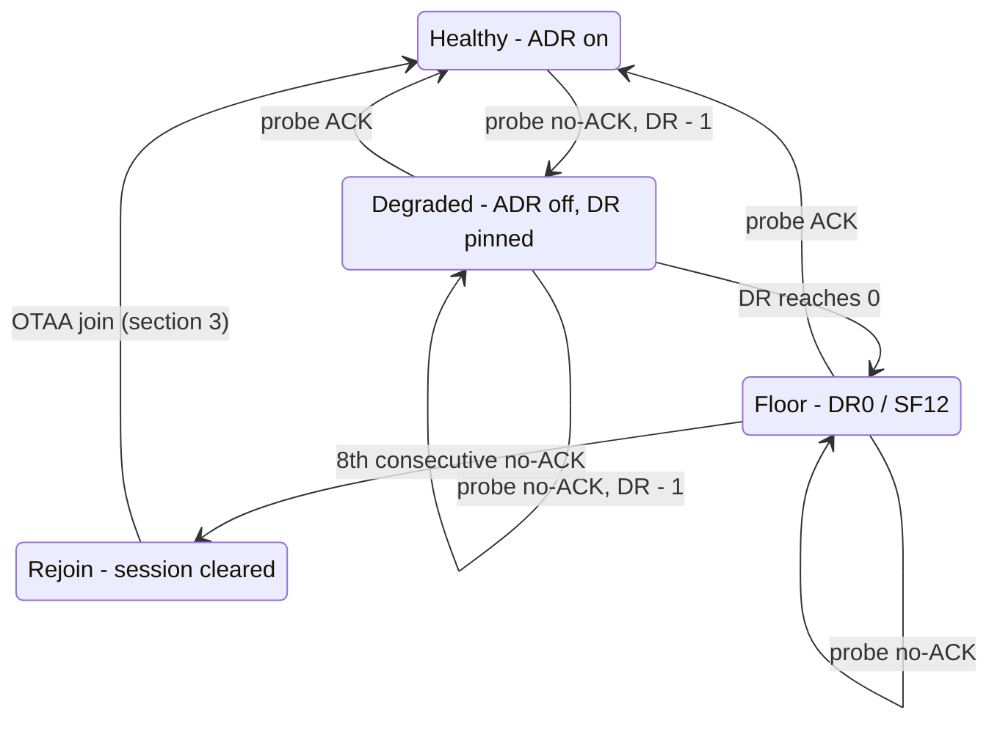

# LoRaWAN Behaviour

How a TanenBase node joins, sends, adapts its data rate, notices a lost link
and recovers, and why each rule exists. Everything here lives in
[`src/drivers/lora.c`](../src/drivers/lora.c) unless noted.

Class A, OTAA, EU868, The Things Network (TTN), LoRaMac-node via Zephyr's
`lorawan` API.

---

## 1. The constraint everything follows from

The node spends almost all its time in **System OFF**, which wipes RAM. Every
wake is a cold boot. Anything LoRaWAN needs to remember must be in flash (ZMS),
and anything that lives only in RAM is lost when the node sleeps.

What is persisted, and where:

| ZMS id | Record | Written | Purpose |
|---|---|---|---|
| 1 | DevNonce | before every join goes on air | replay protection; a reused nonce is rejected by TTN |
| 2 | Session (`LoRaMacNvmData_t`, 1120 B) | after every transmitting wake | keys, frame counters, DR, ADR state, channel table |
| 16 | Link state (`link_state_t`) | every uplink / join attempt | probe counter, no-ACK count, pinned DR, join failures, join backoff |
| 17 | TX pending | end of transmitting wake | retry a failed uplink on the next wake |
| 22 | Pending MAC answers | only when the MAC has answers queued | see §5 |

The radio is only started on wakes that transmit. Measure-only wakes never
touch it.

---

## 2. A normal transmitting wake

1. FSM decides to transmit (heartbeat, anomaly, or a pending retry) and calls
   `lora_init()`.
2. `lora_init()` starts the MAC once per boot, then **restores the session**
   from ZMS. No session → OTAA join (§3).
3. `apply_link_policy()` sets NbTrans = 1 and either ADR on (healthy) or ADR
   off with a pinned DR (degraded, §7).
4. Pending MAC answers from the previous wake are re-queued (§5).
5. `lora_send()` sends the frame on port 1: unconfirmed, or confirmed if it is
   a probe (§6) or a weight anomaly.
6. RX1/RX2 windows: any downlink is processed (MAC commands, config ports).
7. FSM calls `lora_session_save()`: session + pending MAC answers to ZMS.
8. System OFF.

`lora_init()` is idempotent within a boot. SETUP's BLE LoRa test and the
FSM's transmit can both run in one boot; the second call returns immediately
and reuses the live session. It must not restart the MAC or re-register the
downlink callback, because appending the callback node a second time makes the
callback list point to itself and the next downlink loops until the watchdog
resets the node.

---

## 3. Joining (OTAA)

Triggered when there is no stored session: first boot, after BLE
*Clear Session*, after a rejoin decision (§8), or after a firmware update that
changed the session size.

| Attempt | DR | SF | JoinRequest airtime |
|---|---|---|---|
| 1st | DR3 | SF9 | ~0.2 s |
| 2nd | DR2 | SF10 | ~0.4 s |
| 3rd | DR1 | SF11 | ~0.8 s |
| 4th and later | DR0 | SF12 | ~1.5 s |

- One attempt per wake. A failed join sets TX pending, so the next wake
  (every `ms_interval`, 5 min by default) tries again one DR lower.
- **SF12 join backoff.** Once attempts are at DR0 and still failing, the node
  waits **1 h, 2 h, 4 h, then every 8 h** between attempts instead of trying
  every wake. It counts wakes, not time (`join_wait` in the link state), and no
  DevNonce is used while waiting. Without the backoff, a node out of range
  would send an SF12 JoinRequest every 5 min: ~430 s/day of airtime against
  TTN's 30 s fair use.
- **DevNonce is written to flash before the JoinRequest goes on air.** If ZMS
  is unavailable the join is aborted: resending nonce 0 forever would get
  every join replay-rejected and drain the battery.
- On success: failure counters reset, the node starts **at the DR the join
  succeeded on**, with ADR on. A join that only got through at SF12 must not
  send its first data frame at SF9, which would be lost.
- The join-accept carries TTN's channel list (CFList): 867.1, 867.3, 867.5,
  867.7, 867.9 MHz, on top of the three default channels 868.1/.3/.5.

---

## 4. ADR: the network tunes the data rate

With ADR on, TTN watches the SNR of recent uplinks and sends a **LinkADRReq**
(DR, TX power, channel mask) piggybacked on a downlink. The node applies it
and answers with a **LinkADRAns** in the next uplink.

Typical first minutes of a node close to the gateway:

| Uplink | SF | Downlink |
|---|---|---|
| join wake | SF9 | LinkADRReq DR5, TX power 1 |
| next | SF7 | LinkADRReq DR5, TX power 2 (TTN lowering power step by step) |
| … | SF7 | a few more, then **no downlink at all** |

Once converged, uplinks go out without any downlink after them. A downlink after
every uplink means something is wrong (§12).

The node only accepts a LinkADRReq if **every** channel in its mask is known.
TTN asks for channels 0–7, so the channel table from the join-accept must
survive sleep. It is part of the session blob (see the build note in §11).

---

## 5. MAC answers across sleep

LoRaMac keeps queued MAC answers (LinkADRAns, DevStatusAns, RXParamSetupAns,
…) in a RAM-only list, **not** in its NVM context. They go out in the *next*
uplink, which is after System OFF, so without help every answer is lost. TTN
then never sees the answer and repeats the command after every uplink.

The firmware saves that list with the session (ZMS id 22) and re-queues it on
restore, so the next uplink carries it in FOpts:

```
Persisting pending MAC answers:  03 07        (end of wake N)
Re-queued 1 MAC answer(s) for this uplink     (wake N+1)
```

Only end-device answers with a known size are re-queued. Requests
(LinkCheckReq, DeviceTimeReq) are dropped, since their answers need MAC state
that does not survive the reset either. The record is cleared on a fresh join
and when a rejoin is scheduled.

---

## 6. Probes: noticing a dead link

Unconfirmed uplinks are fire-and-forget, so without a downlink the node
cannot tell whether anything arrived. Every **4th uplink** is therefore sent
**confirmed** (a *probe*); the network's ACK proves the link works in both
directions.

| | Healthy | Degraded |
|---|---|---|
| Probe cadence | every 4th uplink | every 4th uplink |
| Downlinks/day at 1 h heartbeat | ~6 | ~6 |

TTN's fair use allows 10 downlinks/day. A shared community gateway also cannot
serve a downlink on every wake; probing every cycle guaranteed missing ACKs and
kept nodes stuck.

A weight-anomaly frame is always confirmed and counts as a probe.

A probe without an ACK is **not** a transmit failure: the frame went on air,
only the downlink is missing. It returns success to the FSM (no retry) and only
feeds the link-health ladder.

---

## 7. Link-health ladder



- **Step down:** each no-ACK probe lowers the DR by one (more range, longer
  airtime), starting from the DR the node is actually on. ADR is switched off
  so the pinned DR sticks (`forced_dr` in the link state).
- **Floor:** at DR0 the node stays put. A missing ACK means the *downlink*
  failed; on a marginal link the uplinks often still arrive, so the session is
  not thrown away early.
- **Rejoin:** after **8 consecutive no-ACK probes** (step-downs included) the
  session is cleared and the next transmitting wake joins again (§3).
- **Recover:** any ACKed probe clears the failure count, removes the pin and
  switches ADR back on **at the current DR**. TTN then raises the DR as far as
  the measured SNR allows. The node does not jump back up on its own, which
  would risk bouncing straight back into a dead DR.

Why ADR alone is not enough: LoRaMac's own ADR back-off (ADR_ACK_LIMIT 64 +
ADR_ACK_DELAY 32) needs 128 uplinks before the first step down. That is more
than 5 days at a 1 h heartbeat.

---

## 8. Scenarios

Timings assume a **1 h heartbeat** and no anomalies. At a 4 h heartbeat
multiply by 4.

### 8.1 Installed near a gateway
Join at SF9 → ADR moves it to SF7 within the first one or two uplinks and
lowers TX power. From then on: one 62 ms uplink per hour, a confirmed probe
every 4 h, no other downlinks.

### 8.2 Far from the gateway, but reachable
The join may only succeed at SF10–SF12 (§3). The node starts at that DR with
ADR on; TTN moves it only as far up as the SNR allows. Nothing else happens.

### 8.3 Node moved away (or an obstacle appears)
| Time | Event |
|---|---|
| 0 | Uplinks at the old SF stop arriving; data is lost from here |
| ≤ 4 h | Next probe gets no ACK → degraded, one SF higher |
| +4 h each | Next probe: ACK → recovered at this SF; no ACK → one more step |
| ≤ 20 h | At SF12 in the worst case (from SF7) |

As soon as the node is on a DR that reaches the gateway, its normal uplinks
arrive again. The next probe confirms it and turns ADR back on. Data loss is
limited to the hours spent at DRs that do not reach.

### 8.4 Uplinks arrive, ACKs don't
Shared or busy gateway, or a strongly asymmetric link. The ladder walks down to
SF12 and stays there. Uplinks keep arriving the whole time. Only after 8
missed ACKs in a row (~32 h) is a rejoin scheduled. Any ACK in between
restores normal operation.

### 8.5 Out of range entirely
Ladder to SF12 (≤ 20 h), then missed probes at the floor until 8 in a row →
rejoin (≤ 32 h after the move). Joins then step DR3 → DR0 one per wake, then back off 1 h,
2 h, 4 h, 8 h, 8 h … Uplinks are not sent while unjoined; the FSM keeps
TX pending, so the first wake after a successful join transmits immediately.

### 8.6 Node brought back into range
Whatever state it is in, the next probe ACK (degraded/floor) or the next join
attempt (rejoin/backoff) succeeds and the node returns to §8.1 or §8.2. An
installer can skip the wait with the BLE LoRa test (§9).

### 8.7 Session lost on the network side
E.g. device re-registered in TTN, or TTN forgot the session. TTN silently drops
the uplinks, probes get no ACK, and the node behaves as in §8.5 until the
rejoin (~32 h). To shorten this, trigger *Clear Session* over BLE.

### 8.8 Sitting at SF12 on a short heartbeat
An SF12 frame is ~1.5 s on air (1.65 s with Extended Mode blocks). At a 1 h
heartbeat that is ~36 s/day, over TTN's 30 s fair use. So when the node is at
DR0 **and** `tx_interval` is below 2 h, every other routine uplink is skipped
(`SF12 fair use: routine uplink skipped`), which brings it to ~18 s/day. Probes,
weight-anomaly frames and the BLE test always go. A skipped uplink is not
retried and does not move the anomaly baseline (`last_tx_*`). Temperature
anomalies are unconfirmed, so every other one can be skipped at SF12.

### 8.9 Transmit fails before reaching the air
Radio error, MAC busy, duty-cycle limit. `lora_send()` returns the error, the
FSM sets TX pending, and the next wake transmits regardless of the heartbeat.

### 8.10 Firmware update
A new image whose session struct has a different size logs
`Session size mismatch` and joins again once. A link-state record of a
different size is reset to healthy defaults. Frame counters and keys are then fresh; nothing else to do.

### 8.11 Configuration by downlink
Any downlink on these ports changes one setting, persisted immediately:

| FPort | Setting | Payload |
|---|---|---|
| 10 | `tx_interval` (heartbeat) | uint32 BE seconds, must be ≥ `ms_interval` |
| 11 | `ms_interval` (measure period) | uint32 BE seconds, ≥ 60, ≤ `tx_interval` |
| 12 | weight anomaly threshold | uint16 BE |
| 13 | temperature anomaly threshold | uint16 BE |

`web/encoder.html` builds these payloads. Downlinks are only received after an
uplink (Class A), so a queued command takes effect at the next transmitting
wake.

---

## 9. Installer actions over BLE (SETUP mode)

| Action | Effect |
|---|---|
| **LoRa test** | Joins if needed and sends one frame in a dedicated thread. Marks the wake *manual*: the SF12 join backoff and the fair-use skip are bypassed, because the installer is standing next to the node. |
| **Clear Session** | Deletes the stored session. The next transmit joins from scratch (DR3). |

---

## 10. Tunables

In [`lora.c`](../src/drivers/lora.c):

| Constant | Value | Meaning |
|---|---|---|
| `HEALTHY_DR` | DR3 (SF9) | first join attempt |
| `PROBE_EVERY_N_UPLINKS` | 4 | healthy probe cadence (must be even) |
| `PROBE_EVERY_N_DEGRADED` | 4 | degraded probe cadence (must be even) |
| `LINK_FAIL_REJOIN` | 8 | consecutive no-ACK probes before a rejoin |
| `DR0_MIN_TX_INTERVAL_S` | 7200 | below this heartbeat, skip every other SF12 uplink |
| `JOIN_BACKOFF_BASE_S` | 3600 | first SF12 join backoff |
| `JOIN_BACKOFF_MAX_SHIFT` | 3 | backoff doubles up to 8 h |

Other settings: NbTrans = 1 (a confirmed frame is sent once, never repeated
by the MAC); `CONFIG_LORAWAN_SYSTEM_MAX_RX_ERROR=100` in `prj.conf`.

Airtime reference (EU868, 125 kHz, CR 4/5):

| SF | 8-byte uplink | per day at 1 h |
|---|---|---|
| SF7 | 62 ms | 1.5 s |
| SF9 | ~0.2 s | ~5 s |
| SF12 | ~1.5 s | ~36 s (fair use: 30 s) |

---

## 11. Build requirement: app and LoRaMac must agree on the session layout

The session blob is `sizeof(LoRaMacNvmData_t)` **as `lora.c` sees it**. That
struct changes size with the `REGION_*` and `SOFT_SE` defines. The LoRaMac
library is compiled with them; `lora.c` must be too. `CMakeLists.txt` adds them
to the app, and `lora.c` fails to compile if they are missing.

Before this was fixed (2026-09-30) the app saw 728 B instead of 1120 B. Every
save dropped the end of the struct, which holds the channel table. After a
wake the node knew only 3 channels, NACKed the channel mask of every
LinkADRReq, and TTN's ADR could never move it. Nodes sat at SF8–SF12 next to
a gateway.

If you touch LoRaMac internals from app code, compare the `-D` flags of
`src/drivers/lora.c` and `mac/LoRaMac.c` in `build/compile_commands.json`.

---

## 12. Troubleshooting

### Device log

| Line | Meaning |
|---|---|
| `Session restored, DevAddr: …` | normal wake with a stored session |
| `No saved session, joining via OTAA` | join (§3) |
| `Session size mismatch` | image changed the session layout; one rejoin follows |
| `Link policy: fresh join DR3 (SF9) + ADR` | joined; ADR takes over |
| `Link policy: DEGRADED DR1 (SF11) sparse-probe` | pinned by the ladder (§7) |
| `Probe uplink (8 B) ACKed` / `no-ACK` | probe result |
| `Degraded: ADR off, DR2 (SF10) (2 no-ACK)` | ladder stepped down |
| `DR floor: probe no-ACK (6/8)` | at SF12, counting towards a rejoin |
| `Link recovered → ADR` | probe ACKed, ADR back on |
| `No downlink for 8 probes … OTAA rejoin next boot` | rejoin scheduled |
| `SF12 join failed — backing off 3600 s (12 wakes)` | join backoff started |
| `Join backoff: next SF12 try in N wake(s)` | waiting, no radio use |
| `SF12 fair use: routine uplink skipped` | §8.8 |
| `Persisting pending MAC answers:` / `Re-queued …` | §5 |
| `Datarate changed: DR_5` on the first uplink of a wake | cosmetic: Zephyr resets its RAM copy of the DR at boot |

Enable `LOG_DBG` in `lora.c` to also get the channel table
(`ch[joined|restored|save] mask=0x00ff f/100k=8681 8683 8685 8671 …`).

### TTN console

| Symptom | Meaning |
|---|---|
| Uplinks on 867.x MHz as well as 868.x | channel table intact |
| Uplinks **only** on 868.1/868.3/868.5 | channel table lost (§11) |
| Uplink `f_opts` `03 07` | LinkADRAns: all accepted |
| Uplink `f_opts` `03 06`, event `link_adr.answer.reject` | channel mask NACKed (§11) |
| A LinkADRReq downlink after **every** uplink | answers lost (§5) or rejected (§11) |
| `ns.mac.command.unanswered` | the node never answered; answers lost across sleep |
| `adr` missing on uplinks | node is degraded (ADR off) |
| SF stays high while RSSI is strong | ADR blocked; check the two rows above |

Decoding `f_opts` of a LinkADRReq, e.g. `03 52 ff00 01`: `03` = LinkADRReq,
`5` = DR5, `2` = TX power index 2, `ff00` = channels 0–7, `01` = NbTrans 1.
