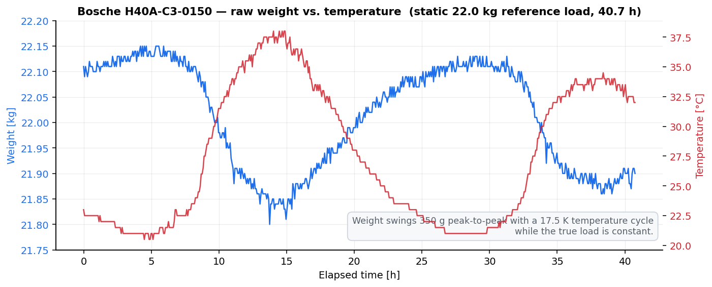
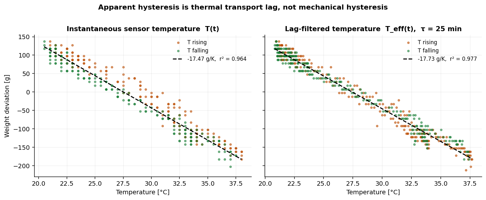
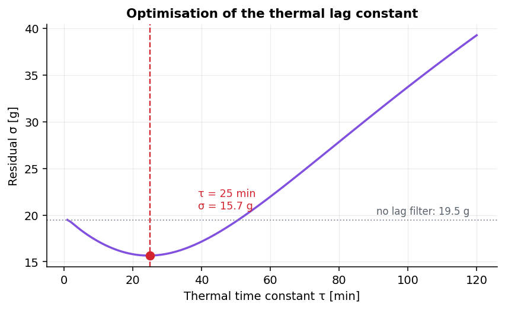
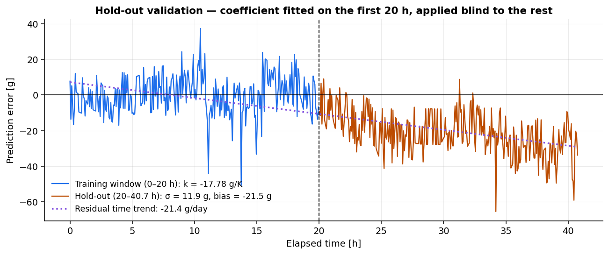
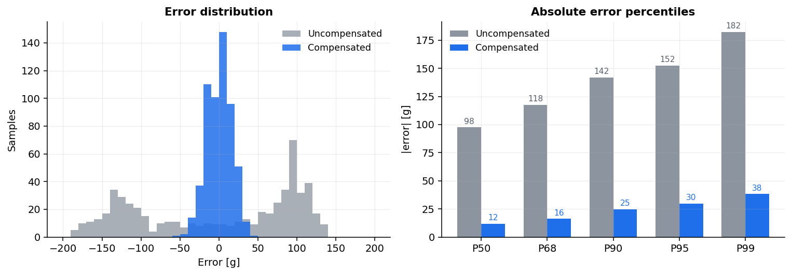

# Temperature Drift Characterisation — Bosche H40A-C3-0150

**Project:** TANEN BASE · open-source hive monitoring
**Device under test:** Bosche `H40A-C3-0150` single-point aluminium load cell (OIML R60 class C3, E<sub>max</sub> = 150 kg)
**Measurement period:** 2026-08-10 00:03 UTC → 2026-08-11 16:48 UTC (40.7 h)
**Samples:** 572 @ 4.27 min
**Load:** ~22.0 kg, static
**Raw data:** [`data/Loadcell_B.csv`](data/Loadcell_B.csv)
**Reproduce:** `python analysis/tempcomp_analysis.py`

---

## TL;DR

Uncompensated, the cell reports a **350 g peak-to-peak swing on a constant 22 kg load** over a 17.5 K daily temperature cycle. That is 16 g of phantom weight per kelvin.

A two-parameter correction — one gain constant plus a first-order thermal lag filter — reduces the error to **σ = 15.7 g**, a 6.5× improvement, landing within ~1.6× of the digitisation noise floor.

```
W_corr = W_raw + 17.73 g/K · (T_eff − 25 °C)
T_eff[n] = T_eff[n−1] + α · (T[n] − T_eff[n−1]),   τ = 25 min
```

This runs on-device: [`src/features/measurement/tempcomp.c`](../../../src/features/measurement/tempcomp.c), `CONFIG_TANENBASE_TEMPCOMP=y` by default — see §6.



---

## 1. Results

| Metric | Uncompensated | Compensated | Improvement |
|---|---:|---:|---:|
| Std deviation σ | 102.2 g | **15.7 g** | 6.5× |
| Peak-to-peak | 350 g | **103 g** | 3.4× |
| P95 absolute error | 168 g | **29.9 g** | 5.6× |
| Relative to 150 kg FS | 0.233 % | **0.010 %** | — |

**Fitted model coefficients**

| Parameter | Value | Note |
|---|---|---|
| `k` (temperature coefficient) | **−17.734 g/K** | 95 % CI ± 0.226 g/K |
| `τ` (thermal time constant) | **25 min** | optimised, see Fig. 3 |
| `T_ref` | 25 °C | arbitrary; choose your tare temperature |
| `r²` | 0.9765 | T<sub>eff</sub> vs. W |
| Noise floor | 9.6 g | sample-to-sample, includes 10 g quantisation |


---

## 2. The apparent hysteresis is transport lag, not mechanical hysteresis

Plotting weight directly against the instantaneous sensor temperature opens a visible loop (~26 g gap between rising and falling branches). This is not creep and not spring-element hysteresis — it is the temperature sensor and the cell body being at different temperatures during a ramp.

Passing the temperature through a single-pole low-pass filter with τ = 25 min collapses the loop to **1.2 g** and lifts r² from 0.964 to 0.977. No hysteresis term is needed in the model.



The 25 min constant was found by sweeping τ and minimising the residual. The minimum is broad and shallow — anything from 15 to 40 min performs within 1 g, so the value does not need to be tuned per unit.



---

## 3. Hold-out validation

The coefficient was fitted on the first 20 h only and applied blind to the remaining 20.7 h.

- `k` fitted on training window: **−17.777 g/K** vs. −17.734 g/K on the full set → the coefficient is stable, not overfitted.
- Hold-out scatter: **σ = 11.9 g**
- Hold-out bias: **−21.5 g**, growing linearly



The residual bias is a **−22.6 g/day linear trend** that survives temperature compensation. This is the single most important open item in this report — see §5.



---

## 4. The drift does not come from the load cell

This is the finding that matters for the hardware design, and it contradicts the intuitive reading.

**Check against the OIML R60 class C3 envelope.** For E<sub>max</sub> = 150 kg at n<sub>LC</sub> = 4000 (Y = 10 000), v<sub>min</sub> = 15 g. The R60 limit for temperature effect on minimum dead-load output is 0.7 · v<sub>min</sub> per 5 K ≈ **2.1 g/K**. The measured 17.7 g/K is **8.4× outside** that envelope. A cell shipping with a C3 test certificate does not miss its own spec by 8×.

**Check against span drift.** At 22 kg the load is 14.7 % of full scale. A typical C3 sensitivity TC of 0.010 %/10 K of applied load would produce **0.22 g/K** — two orders of magnitude short of what was measured.

**Check the ADC.** Referred to the bridge input at C<sub>n</sub> = 2.0 mV/V and 5 V excitation, the cell delivers 66.7 nV/g. 17.73 g/K therefore corresponds to **≈ 1.18 µV/K at the ADC input**. HX711 and NAU7802 both specify offset drift on the order of 5–10 nV/K. The measured drift is **~200× the converter's own offset TC**, and a ratiometric bridge configuration cancels reference drift entirely.

**Conclusion:** neither the spring element, nor the bridge compensation, nor the converter can account for 17.7 g/K. The drift originates **outside the sensing chain**. In order of likelihood:

1. **Mechanical parasitic load path.** Differential thermal expansion between the aluminium spring element (α ≈ 23 µm/m·K) and a steel frame or hive stand injects a side load into the cell. This is by far the most common cause on hive scales and scales exactly like what was measured.
2. **Real mass change correlated with temperature** — evaporation, or forager traffic if the load is a live colony rather than a dead reference weight.
3. Moisture ingress into the potting, or thermal EMF at cable junctions and terminal blocks.

---

## 5. Open items — read before trusting these numbers

**This report characterises a system, not a load cell.** Do not quote −17.73 g/K as an H40A property. It is the temperature response of *this* cell in *this* mount with *this* frame, and it will change if you change the mounting.

| # | Issue | Impact | Action |
|---|---|---|---|
| 1 | Is the 22 kg load a dead reference weight or a live hive? | Determines whether the −22.6 g/day trend is sensor drift or real mass loss. Not resolvable from this dataset. | Repeat with a certified dead weight. |
| 2 | Only 40.7 h, one temperature cycle (20.5–38.0 °C) | Model is unvalidated below 20 °C. A hive scale sees −10 °C. | Extend to a full seasonal range or use a climate chamber. |
| 3 | Weight resolution is 10 g (1 LSB) | Residual σ of 15.7 g is only 1.6 LSB. Cannot resolve model error below the noise floor. | Log raw 24-bit ADC counts, not rounded kilograms. |
| 4 | Temperature resolution 0.5 K, sensor not on the cell body | The 25 min lag is direct evidence of poor thermal coupling. Costs ~2 g of residual. | Bond an NTC or DS18B20 to the aluminium body of the cell. |
| 5 | Single load point (22 kg only) | Cannot separate zero drift (load-independent) from span drift (load-proportional). The correction may not hold at 60 kg. | Repeat at 0 kg, 20 kg, 50 kg, 100 kg. |
| 6 | Single unit, n = 1 | No unit-to-unit spread. The firmware ships this `k` as the **default**, fitted on one cell in one mount. | Characterise at least 3 cells before treating it as a constant. Per-unit override: `CONFIG_TANENBASE_TEMPCOMP_GAIN_MG_PER_K`, or `0` to disable. |

---

## 6. Correction equation

### Deployed form

```
T_eff[n] = T_eff[n−1] + α · (T[n] − T_eff[n−1])
α        = 1 − exp(−Δt / τ),      τ = 25 min

W_corr[n] = W_raw[n] + k_c · (T_eff[n] − T_ref)

k_c   = +0.017734 kg/K   (= −k, the compensation gain)
T_ref = tare temperature [°C]
```

Initialise `T_eff[0] = T[0]` so the filter does not ramp from zero on cold boot.

### Do NOT put the time-drift term in firmware

The fit is materially better with a −22.6 g/day term (σ drops 15.7 → 11.3 g). **Leave it out.** On a hive scale, day-over-day mass change *is the measurement*. Subtracting a fitted daily slope would erase a real nectar flow of exactly that magnitude. Track the trend as a diagnostic; never as a correction.

### Firmware

Shipped implementation: [`src/features/measurement/tempcomp.c`](../../../src/features/measurement/tempcomp.c), enabled by `CONFIG_TANENBASE_TEMPCOMP` and applied in `measure.c` between the scale-factor conversion and the 999 kg clamp. Integer-only, no floating point, no dynamic allocation.

Three things the node has to get right that a desk implementation does not:

- **`T_eff` has to outlive the sleep.** RAM is wiped on every System OFF, so the filter state is persisted in ZMS and reloaded on each wake. Without that it would re-seed every cycle and the 25 min lag term would never do anything.
- **Δt is per call.** The first sample of a wake assumes the node slept for the configured measurement interval — there is no wall clock across System OFF — while later samples in the same wake (the 2 s BLE live view) use measured uptime. A wake that is *not* the measurement timer (button, reset, brownout) has an unknown gap, so the filter drops the stored `T_eff` and re-seeds instead of applying a correction from a stale one.
- **`T_ref` is the tare temperature — specifically `T_eff` at the tare.** The zero offset and `T_ref` are two halves of one zero and are captured in the same command; anchoring `T_ref` to the instantaneous probe reading instead would bake the probe-to-body lag straight into the zero. Until the first tare, `CONFIG_TANENBASE_TEMPCOMP_T_REF_MDEG` (25 °C) stands in — on a cell tared at 30 °C that stale default is a standing **+89 g**, which is what a "tare doesn't zero" symptom looks like.

| Kconfig | Default | |
|---|---|---|
| `CONFIG_TANENBASE_TEMPCOMP` | `y` | compile the correction in |
| `CONFIG_TANENBASE_TEMPCOMP_GAIN_MG_PER_K` | `17734` | k<sub>c</sub>, per cell **and mount** — `0` keeps the filter running but applies no correction |
| `CONFIG_TANENBASE_TEMPCOMP_TAU_S` | `1500` | τ, 25 min |
| `CONFIG_TANENBASE_TEMPCOMP_T_REF_MDEG` | `25000` | fallback T<sub>ref</sub> before the first tare |

If the temperature probe fails, the weight is reported **uncorrected** rather than corrected against a stale `T_eff` — and the uplink still carries the temp-invalid sentinel, so the two are distinguishable downstream.

[`firmware/`](firmware/) keeps the same arithmetic standalone so the dataset can be replayed on a host. It lands on the same numbers as the Python model:

```console
$ gcc -O2 -std=c99 -o host_test firmware/host_test.c firmware/tanen_tempcomp.c -lm
$ ./host_test data/Loadcell_B.csv
n=572
raw : mean=22.0124 kg sigma=102.2 g p2p=350 g
comp: mean=22.0554 kg sigma=15.7 g p2p=103 g
```

---

## 7. Recommended hardware changes

1. **Fix the mount before tuning the software.** Software compensation of a mechanical fault is a workaround with a limited validity window. Mount the cell on a kinematic or slotted mount so the frame cannot transfer thermal expansion into it. Steel bolts through an aluminium body are a classic offender.
2. **Bond the temperature sensor to the cell.** A DS18B20 in thermal paste against the aluminium body eliminates the 25 min lag and the residual it costs.
3. **Log raw ADC counts.** Rounding to 10 g throws away roughly 4 bits before the compensation ever runs.
4. **150 kg is oversized.** A Dadant or Langstroth hive rarely exceeds 90 kg gross. A 100 kg cell would give a 1.5× better signal-to-noise at the same absolute drift.

---

## 8. Files

```
docs/load_cells/H40A-C3-0150/
├── README.md
├── data/
│   ├── Loadcell_B.csv                  raw measurement (time;T_C;W_raw_kg)
│   └── Loadcell_B_compensated.csv      raw + T_eff + W_corr + residual
├── analysis/
│   └── tempcomp_analysis.py            full pipeline, regenerates every figure
├── firmware/
│   ├── tanen_tempcomp.c                standalone copy of the shipped maths
│   ├── tanen_tempcomp.h
│   └── host_test.c                     replays the CSV through the firmware
└── figures/
    ├── 01_raw_overview.png
    ├── 02_hysteresis_lag.png
    ├── 03_tau_sweep.png
    ├── 04_before_after.png
    ├── 05_error_distribution.png
    └── 06_validation.png
```

---

## Licence

Data and analysis released under CC BY 4.0. Code under MIT, consistent with the rest of TANEN.
